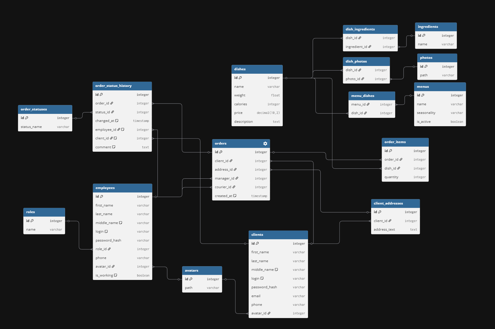

# 🍽️ Restaurant Management System

> **Restaurant Management System** — система управления заказами ресторана с поддержкой заказов, меню, блюд и управления сотрудниками.



## 🚀 О проекте

- **Система управления рестораном** для автоматизации процессов работы
- **REST API** для работы с различными сущностями
- **Раздельная авторизация** для сотрудников и клиентов через JWT токены
- **Управление сотрудниками** с ролями: Админ, Менеджер, Курьер
- **Управление клиентской базой**
- **Управление меню и блюдами** с фотографиями, ингредиентами и описаниями
- **Обработка заказов** с назначением курьеров и отслеживанием статусов
- **История изменений статусов** заказов с указанием, кто внес изменения
- **Группировка блюд в меню** с учетом сезонности
- **Документация API** в формате OpenAPI 3.0.3 (Swagger)

> 💡 Проект находится на стадии проектирования
---

## 👥 Роли пользователей

- **Admin (Администратор)**: полный доступ ко всем операциям системы, управление ролями и сотрудниками
- **Manager (Менеджер)**: управление меню, блюдами, заказами, назначение курьеров
- **Courier (Курьер)**: просмотр назначенных заказов, изменение статуса доставки
- **Client (Клиент)**: регистрация, просмотр меню, создание и отслеживание заказов

---

## 📁 Структура проекта

```
RestaurantManagementSystem/
├── documentation/          # Документация проекта
│   ├── db.dbml            # Схема базы данных (DBML)
│   ├── swagger.yaml       # API документация (OpenAPI 3.0.3)
│   ├── Пояснительная записка.pdf
│   └── Пояснительная записка.docx
├── screenshots/            # Медиа
│   └── ERD.png            # ERD диаграмма базы данных
├── LICENCE                 # Лицензия проекта
└── README.md              # Этот файл
```

---

## 📄 Лицензия

Проект распространяется под лицензией [**BEER-WARE**](./LICENCE).