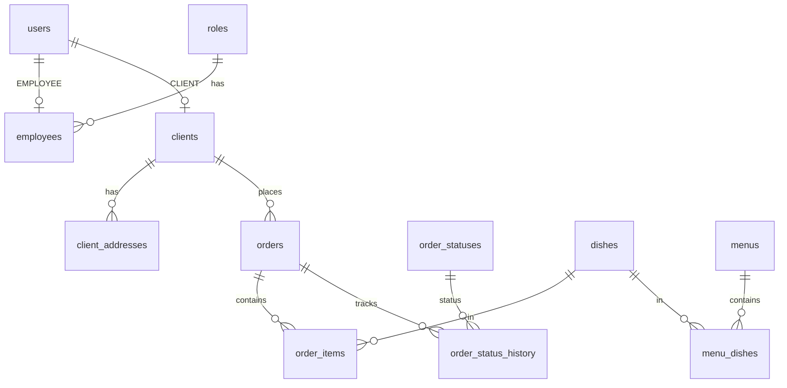

# Сущности и поля

Описание логической модели данных системы. Источник истины: миграции Flyway в [backend/src/main/resources/db/migration/](../../backend/src/main/resources/db/migration/) (ветка `employee`).

См. также: [перечисления](enums.md), диаграмма [db.dbml](../db.dbml).

---

## users

Учётные данные для входа (клиенты и сотрудники).

| Поле | Тип | Ограничения | Описание |
|------|-----|-------------|----------|
| `id` | BIGSERIAL | PK | Идентификатор |
| `login` | VARCHAR(16) | NOT NULL, UNIQUE | Логин (4–16 символов) |
| `password_hash` | VARCHAR(255) | NOT NULL | Хэш пароля (BCrypt) |
| `user_type` | VARCHAR(20) | NOT NULL, CHECK | `CLIENT` или `EMPLOYEE` |

**Связи:** 1:1 с `clients` или `employees` по `user_id`.

---

## roles

Справочник ролей сотрудников.

| Поле | Тип | Ограничения | Описание |
|------|-----|-------------|----------|
| `id` | BIGSERIAL | PK | Идентификатор |
| `name` | VARCHAR(50) | NOT NULL, UNIQUE | `ADMIN`, `MANAGER`, `COURIER` |

**Связи:** 1:N → `employees`.

---

## avatars

Файлы аватаров пользователей.

| Поле | Тип | Ограничения | Описание |
|------|-----|-------------|----------|
| `id` | BIGSERIAL | PK | Идентификатор |
| `path` | VARCHAR(500) | NOT NULL | Путь к файлу в хранилище |

**Связи:** опционально у `employees`, `clients`. API: `/avatars`.

---

## employees

Профиль сотрудника (1:1 с `users` для `user_type = EMPLOYEE`).

| Поле | Тип | Ограничения | Описание |
|------|-----|-------------|----------|
| `user_id` | BIGINT | PK, FK → users.id | Идентификатор = id пользователя |
| `first_name` | VARCHAR(100) | NOT NULL | Имя |
| `last_name` | VARCHAR(100) | NOT NULL | Фамилия |
| `middle_name` | VARCHAR(100) | NULL | Отчество |
| `role_id` | BIGINT | NOT NULL, FK → roles.id | Роль |
| `phone` | VARCHAR(20) | NOT NULL | Телефон |
| `avatar_id` | BIGINT | FK → avatars.id | Аватар |
| `is_working` | BOOLEAN | NOT NULL, DEFAULT false | На смене / доступен для назначения |

**Связи:** N:1 `roles`; опционально `orders.manager_id`, `orders.courier_id`.

---

## clients

Профиль клиента (1:1 с `users` для `user_type = CLIENT`).

| Поле | Тип | Ограничения | Описание |
|------|-----|-------------|----------|
| `user_id` | BIGINT | PK, FK → users.id | Идентификатор |
| `first_name` | VARCHAR(100) | NOT NULL | Имя |
| `last_name` | VARCHAR(100) | NOT NULL | Фамилия |
| `middle_name` | VARCHAR(100) | NULL | Отчество |
| `email` | VARCHAR(255) | NOT NULL, UNIQUE | Email |
| `phone` | VARCHAR(20) | NOT NULL | Телефон |
| `avatar_id` | BIGINT | FK → avatars.id | Аватар |

**Связи:** 1:N → `client_addresses`, `orders`.

---

## client_addresses

Адреса доставки клиента.

| Поле | Тип | Ограничения | Описание |
|------|-----|-------------|----------|
| `id` | BIGSERIAL | PK | Идентификатор |
| `client_id` | BIGINT | NOT NULL, FK → clients.user_id | Клиент |
| `address_text` | TEXT | NOT NULL | Текст адреса |

**Связи:** N:1 `clients`; используется в `orders.address_id`.

---

## dishes

Блюда ресторана.

| Поле | Тип | Ограничения | Описание |
|------|-----|-------------|----------|
| `id` | BIGSERIAL | PK | Идентификатор |
| `name` | VARCHAR(255) | NOT NULL | Название |
| `weight` | FLOAT | NOT NULL | Вес (г) |
| `calories` | INTEGER | NOT NULL | Калорийность |
| `price` | DECIMAL(10,2) | NOT NULL | Цена |
| `description` | TEXT | NULL | Описание |

**Связи:** M:N `photos` через `dish_photos`; M:N `ingredients` через `dish_ingredients`; M:N `menus` через `menu_dishes`; N:1 в `order_items`.

---

## photos

Фотографии блюд (файлы).

| Поле | Тип | Ограничения | Описание |
|------|-----|-------------|----------|
| `id` | BIGSERIAL | PK | Идентификатор |
| `path` | VARCHAR(500) | NOT NULL | Путь к файлу |

**Связи:** M:N `dishes` через `dish_photos`. API: `/photos`, привязка к блюду — `/dishes/{dishId}/photos`.

---

## dish_photos

Связь блюда и фотографии (составной PK).

| Поле | Тип | Описание |
|------|-----|----------|
| `dish_id` | BIGINT | FK → dishes.id (CASCADE при удалении) |
| `photo_id` | BIGINT | FK → photos.id (CASCADE) |

---

## menus

Меню (сезонные, специальные).

| Поле | Тип | Ограничения | Описание |
|------|-----|-------------|----------|
| `id` | BIGSERIAL | PK | Идентификатор |
| `name` | VARCHAR(255) | NOT NULL | Название |
| `seasonality` | VARCHAR(50) | NOT NULL | Сезонность / тип |
| `is_active` | BOOLEAN | NOT NULL, DEFAULT false | Активно ли меню |

**Связи:** M:N `dishes` через `menu_dishes`.

---

## menu_dishes

Блюда в составе меню.

| Поле | Тип | Описание |
|------|-----|----------|
| `menu_id` | BIGINT | FK → menus.id |
| `dish_id` | BIGINT | FK → dishes.id |

---

## ingredients

Справочник ингредиентов.

| Поле | Тип | Ограничения | Описание |
|------|-----|-------------|----------|
| `id` | BIGSERIAL | PK | Идентификатор |
| `name` | VARCHAR(255) | NOT NULL, UNIQUE | Название |

**Связи:** M:N `dishes` через `dish_ingredients`.

---

## dish_ingredients

Состав блюда.

| Поле | Тип | Описание |
|------|-----|----------|
| `dish_id` | BIGINT | FK → dishes.id (CASCADE) |
| `ingredient_id` | BIGINT | FK → ingredients.id (CASCADE) |

---

## order_statuses

Справочник статусов заказа.

| Поле | Тип | Ограничения | Описание |
|------|-----|-------------|----------|
| `id` | BIGSERIAL | PK | Идентификатор |
| `status_name` | VARCHAR(50) | NOT NULL, UNIQUE | Код статуса |

См. [enums.md](enums.md).

---

## orders

Заказ клиента.

| Поле | Тип | Ограничения | Описание |
|------|-----|-------------|----------|
| `id` | BIGSERIAL | PK | Идентификатор |
| `client_id` | BIGINT | NOT NULL, FK → clients.user_id | Клиент |
| `address_id` | BIGINT | NOT NULL, FK → client_addresses.id | Адрес доставки |
| `manager_id` | BIGINT | FK → employees.user_id | Менеджер |
| `courier_id` | BIGINT | FK → employees.user_id | Курьер |
| `total_price` | DECIMAL(12,2) | NOT NULL, DEFAULT 0 | Итоговая сумма |
| `created_at` | TIMESTAMPTZ | NOT NULL | Время создания |

**Связи:** 1:N `order_items`, `order_status_history`.

---

## order_status_history

История смены статусов заказа.

| Поле | Тип | Ограничения | Описание |
|------|-----|-------------|----------|
| `id` | BIGSERIAL | PK | Идентификатор |
| `order_id` | BIGINT | NOT NULL, FK → orders.id | Заказ |
| `status_id` | BIGINT | NOT NULL, FK → order_statuses.id | Новый статус |
| `employee_id` | BIGINT | FK → employees.user_id | Кто изменил (сотрудник) |
| `client_id` | BIGINT | FK → clients.user_id | Кто изменил (клиент) |
| `comment` | TEXT | NULL | Комментарий |
| `changed_at` | TIMESTAMPTZ | NOT NULL | Время изменения |

---

## order_items

Позиции заказа.

| Поле | Тип | Ограничения | Описание |
|------|-----|-------------|----------|
| `id` | BIGSERIAL | PK | Идентификатор |
| `order_id` | BIGINT | NOT NULL, FK → orders.id | Заказ |
| `dish_id` | BIGINT | NOT NULL, FK → dishes.id | Блюдо |
| `quantity` | INTEGER | NOT NULL, CHECK > 0 | Количество |
| `price_at_moment` | DECIMAL(10,2) | NOT NULL | Цена на момент заказа |

---

## Диаграмма связей (кратко)

