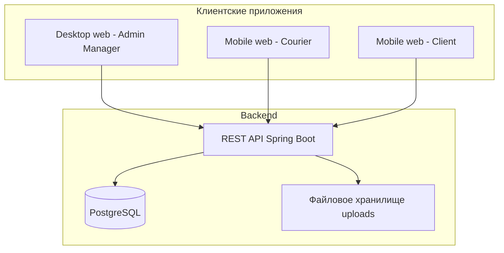

# Описание продукта

**Restaurant Management System (Food Rush)** — веб-система для ресторана с доставкой заказов. Клиенты оформляют заказы через мобильное веб-приложение; сотрудники управляют меню, персоналом и доставкой через desktop web-панель.

## Задачи системы

- Публикация меню и каталога блюд с фото и составом
- Приём и обработка заказов на доставку
- Назначение курьеров и отслеживание статусов
- Учёт клиентов, адресов доставки и сотрудников с разграничением прав

## Пользователи

| Группа | Роли | Интерфейс |
|--------|------|-----------|
| Сотрудники | Администратор, менеджер, курьер | Desktop (admin, manager) / Mobile (courier) |
| Клиенты | Клиент | Mobile web |

Подробнее: [роли пользователей](../roles/index.md).

## Архитектура

- **Backend:** Spring Boot 3.2, JPA, Flyway, Spring Security, JWT, springdoc OpenAPI
- **База данных:** PostgreSQL
- **Frontend:** планируется (submodule `frontend`); спецификация UI — в [документации по ролям](../roles/index.md) и [пояснительной записке](../пояснительная-записка/index.md)

## Ключевые сущности

Пользователи, сотрудники, клиенты, меню, блюда, ингредиенты, заказы, история статусов — см. [модель данных](../data/entities.md).

## API

REST API на порту `8080`, JSON в **snake_case**. Документация:

- [Справочник endpoint-ов](../api/index.md)
- [OpenAPI YAML](../swagger.yaml)
- Swagger UI при запущенном backend: `http://localhost:8080/swagger-ui.html`

## Состояние реализации

| Компонент | Статус |
|-----------|--------|
| Backend API | Реализован (репозиторий `restaurant-backend`, ветка `employee`) |
| Frontend | В разработке |
| Документация в `documentation/` | Актуализирована по backend |
