# Описание и анализ предметной области

Под предметной областью (application domain) принято понимать ту часть реального мира, которая имеет существенное значение или непосредственное отношение к процессу функционирования программы. Другими словами, предметная область включает в себя только те объекты и взаимосвязи между ними, которые необходимы для описания требований и условий решения некоторой задачи [3].

#### Описание предметной области

##### Основные понятия и определения

Ресторан представляет собой предприятие общественного питания, обладающее широкой номенклатурой продукции сложного изготовления и предоставляющее услуги по организации отдыха и питания посетителей. В контексте разрабатываемой автоматизированной системы ресторан рассматривается как объект автоматизации, где ключевыми процессами являются прием, обработка и исполнение заказов [4].

Назначение ресторана в рамках информационной системы делится на два основных направления:

обслуживание в зале – предоставление посадочных мест, сервисное обслуживание официантами (рисунок 1);

доставка – подготовка заказов для передачи курьером.

<!-- fig-id: fig-01 -->

*Рисунок 1 – Обслуживание официантами*

Различают следующие основные виды ресторанов:

рестораны полного цикла – предполагают сложную логику приготовления блюд и высокую степень персонализации заказа;

рестораны быстрого обслуживания – характеризуются ограниченным меню и высокой скоростью отдачи заказов;

кофейни – акцент на напитках и легких закусках, высокая оборачиваемость заказов;

кафе и бистро – заведения с усредненным чеком и полным обслуживанием.

Ресторан обычно ориентирован на определённый вид кухни. Выделяются следующие основные виды кухни:

европейская – традиционные блюда национальной кухни различных стран Европы;

азиатская – блюда стран Востока, часто требующие указания уровня остроты или особых ингредиентов;

кондитерская – специализация на десертах и выпечке;

авторская – комбинация различных кулинарных традиций.

Меню – это структурированный перечень блюд и напитков, доступных для заказа в текущий момент времени [5].

Блюдо – основная единица учета в системе заказа.

Блюда классифицируются по следующим категориям:

закуски – блюда, подаваемые перед основным приемом пищи для возбуждения аппетита. Примеры*:* Салат «Цезарь» с курицей, Брускетта с томатами и базиликом, Карпаччо из говядины, Сырное плато (рисунок 2);

основные блюда – сытные позиции, составляющие основу обеда или ужина. Требуют указания времени приготовления и способа термообработки. Примеры*:* Стейк Рибай средней прожарки, Паста «Карбонара», Лосось на гриле с овощами (рисунок 3);

напитки – жидкие продукты, разделяемые на алкогольные и безалкогольные. Для алкогольной продукции в системе требуется проверка возраста клиента. Примеры*:* Кофе «Латте макиато», Лимонад «Домашний», Вино красное сухое, Чай «Эрл Грей»;

десерты – сладкие блюда, завершающие трапезу. Часто заказываются вместе с горячими напитками. Примеры*:* Тирамису классическое, Чизкейк «Нью-Йорк», Сорбет из манго, Мороженое с шоколадным соусом.

<!-- fig-id: fig-02 -->
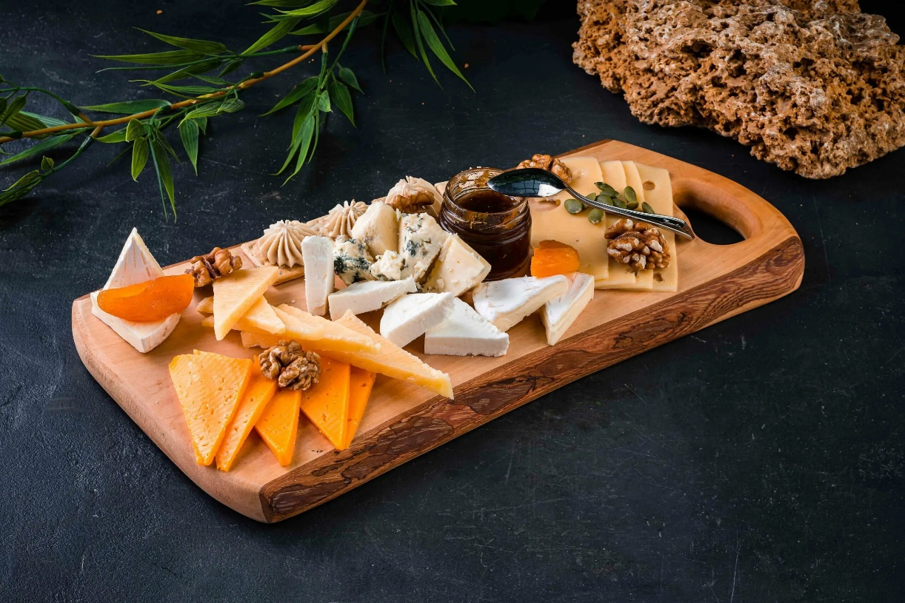

*Рисунок 2 – Сырное плато*

<!-- fig-id: fig-03 -->
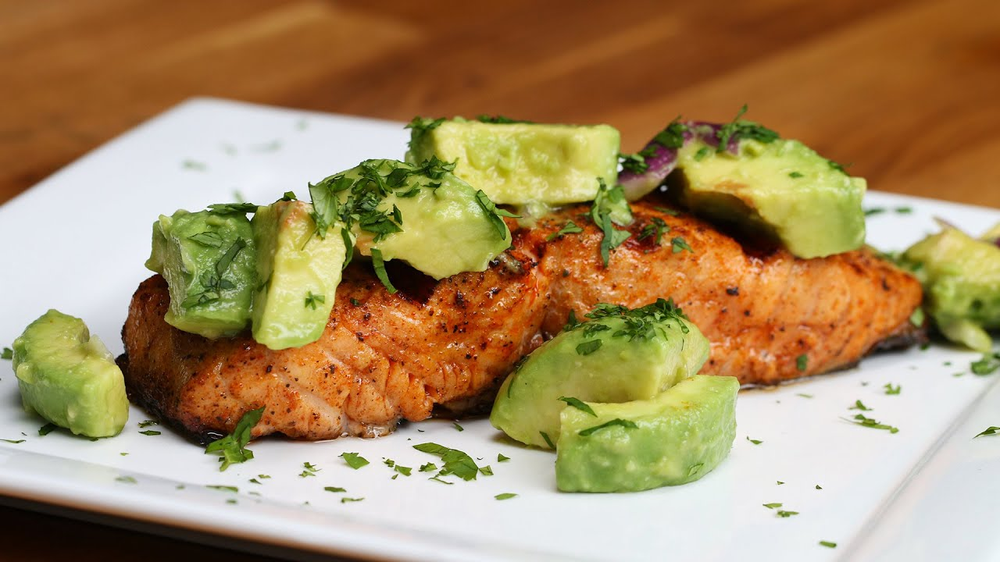

*Рисунок 3 – Лосось на гриле с овощами*

Структура управления рестораном включает несколько уровней персонала, каждый из которых выполняет определённые функции, обеспечивающие эффективную работу заведения.

директор – это руководитель предприятия общественного питания, который осуществляет общее управление деятельностью заведения. Он отвечает за стратегическое развитие ресторана, финансовые результаты и организацию эффективной работы всех подразделений.

менеджер – это сотрудник, отвечающий за организацию текущей работы заведения и координацию персонала в течение рабочей смены. Он обеспечивает бесперебойное функционирование ресторана и высокий уровень обслуживания посетителей;

повар – специалист, занимающийся непосредственным приготовлением блюд в соответствии с технологическими картами и стандартами заведения;

официант – сотрудник ресторана, который осуществляет обслуживание посетителей в зале и обеспечивает комфортное взаимодействие клиента с заведением.

Служба доставки является неотъемлемой частью работы ресторана, если он ориентирован на удаленное создание заказов.

Служба доставки – это подразделение ресторана, обеспечивающее приём, обработку и доставку заказов клиентам вне заведения. В современных условиях доставка стала важной частью ресторанного бизнеса, позволяя расширить аудиторию, увеличить объём продаж и повысить удобство для клиентов.

##### Классификация кроссвордов

Рестораны можно классифицировать по различным признакам: уровню обслуживания, типу кухни, формату обслуживания, ценовой категории и другим характеристикам. Такая классификация позволяет систематизировать предприятия общественного питания и определить особенности их работы, целевую аудиторию и организацию обслуживания.

По уровню обслуживания рестораны делятся на несколько категорий. Рестораны высокого класса отличаются изысканным интерьером, высоким уровнем сервиса, широким ассортиментом блюд и напитков, а также профессиональной подготовкой персонала. Такие заведения часто ориентированы на проведение деловых встреч, торжеств и особых мероприятий. Рестораны среднего класса предлагают качественное обслуживание и разнообразное меню по более доступным ценам. Они ориентированы на широкий круг посетителей. Заведения быстрого обслуживания характеризуются упрощённым меню, высокой скоростью приготовления блюд и доступной стоимостью.

По типу кухни рестораны классифицируются в зависимости от национальных или тематических особенностей меню. Существуют рестораны национальной кухни (итальянской, японской, грузинской и других), а также смешанной кухни, где представлены блюда различных стран. Такой формат позволяет привлекать посетителей с различными вкусовыми предпочтениями.

По способу обслуживания выделяют несколько типов заведений. Классические рестораны предполагают обслуживание официантами, которые принимают заказы и подают блюда гостям. Рестораны самообслуживания предоставляют посетителям возможность самостоятельно выбирать блюда на линии раздачи.

По ценовой категории рестораны можно разделить на бюджетные, средние и премиальные. Стоимость блюд и уровень сервиса напрямую влияют на аудиторию заведения и его позиционирование на рынке.

В таблице 1 приведена классификация ресторанов.

Таблица 1 – Классификация ресторанов

| Тип ресторана | Уровень обслуживания | Ценовая категория | Ассортимент меню |
| --- | --- | --- | --- |
| Ресторан высокого класса | Очень высокий, обслуживание официантами | Высокая | Широкий выбор блюд, авторская кухня, дорогие напитки |
| Ресторан среднего класса | Полноценное обслуживание | Средняя | Разнообразное меню |
| Ресторан быстрого обслуживания | Минимальный или частично самообслуживание | Низкая / средняя | Ограниченный ассортимент |
| Ресторан с самообслуживанием | Самообслуживание | Низкая | Стандартный ассортимент |
| Ресторан с доставкой | Может отсутствовать обслуживание в зале | Разная | Меню оптимизировано для доставки |

#### Описание систем-аналогов

Проведение сравнительного анализа существующих систем-аналогов является обязательным этапом проектирования приложения для удаленного создания заказов в системе ресторана. Данный анализ позволяет выявить лучшие практики и функциональные пробелы на рынке, обосновать выбор технологического стека и архитектурных решений, скорректировать требования к системе с учётом реальных ограничений, а также оценить экономическую целесообразность разработки собственного решения.

##### Веб-приложение для удаленного контроля работы ресторана «IikoWeb»

IikoWeb – это облачный веб-офис системы автоматизации iiko, который позволяет управлять рестораном удалённо из любой точки мира через браузер. Решение предоставляет доступ к аналитике, прогнозам продаж на базе ИИ, складскому учёту, управлению персоналом и контролю финансовых показателей в реальном времени [6]. На рисунке 4 приведена главная экранная форма веб-приложения «IikoWeb», на которой изображены возможности работы с меню и аналитикой. Далее на рисунках 5-6 наглядно представлены экраны, с которыми взаимодействует сотрудник ресторана или кафе.

<!-- fig-id: fig-04 -->
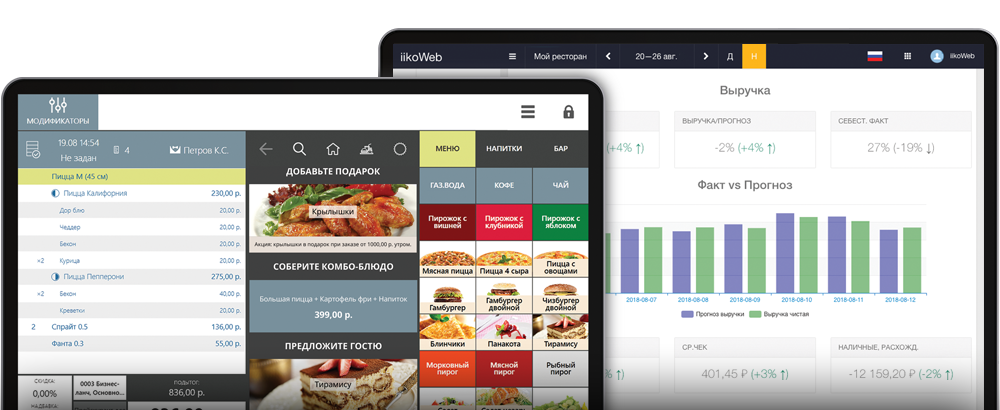

*Рисунок 4 – Главная страница веб-приложения «Iikoweb»*

<!-- fig-id: fig-05 -->
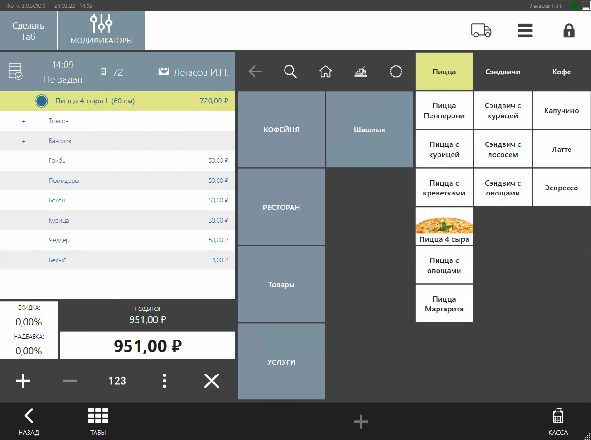

*Рисунок 5 – Экран сотрудника в веб-приложении «Iikoweb»*

<!-- fig-id: fig-06 -->
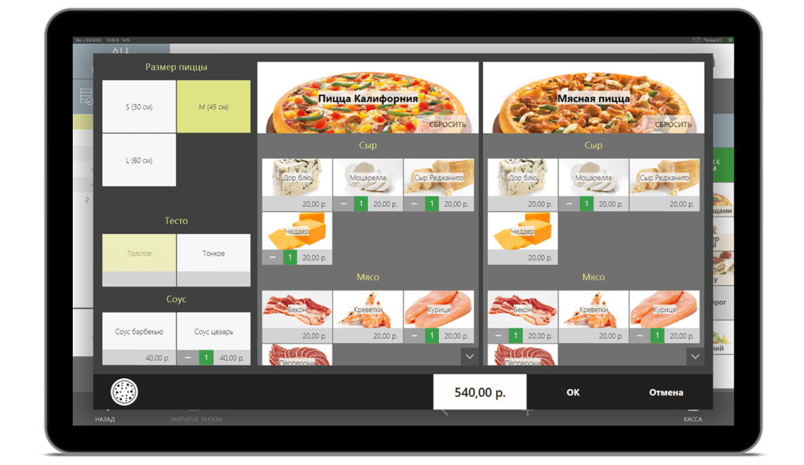

*Рисунок 6 – Экран приложения «Iikoweb»*

К достоинствам данной системы относятся:

- удаленный доступ 24/7;

- интеллектуальная аналитика;

- интеграция в экосистему iiko;

- масштабируемость.

К недостаткам системы относятся:

- требует основной системы iiko;

- сложность освоения.

##### Экосистема автоматизации ресторанного бизнеса «YUMA»

YUMA представляет собой экосистему автоматизации ресторанного бизнеса с акцентом на маркетинговые инструменты и управление меню [7]. Система позволяет вести складской учет, управлять персоналом и создавать меню без ограничений, а также интегрируется с крупными агрегаторами доставки еды, такими как Яндекс.Еда и Delivery. На рисунке 7 приведена главная экранная форма приложения «YUMA», на которой представлены возможности анализа и получения сводной информации. На рисунках 8-9 представлены киоск самообслуживания и электронная очередь, а также скриншот экрана с наглядным представлением возможностей официанта.

<!-- fig-id: fig-07 -->
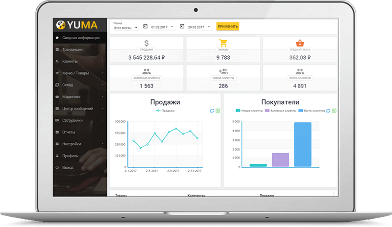

*Рисунок 7 – Экранная форма веб-приложения «YUMA»*

<!-- fig-id: fig-08 -->
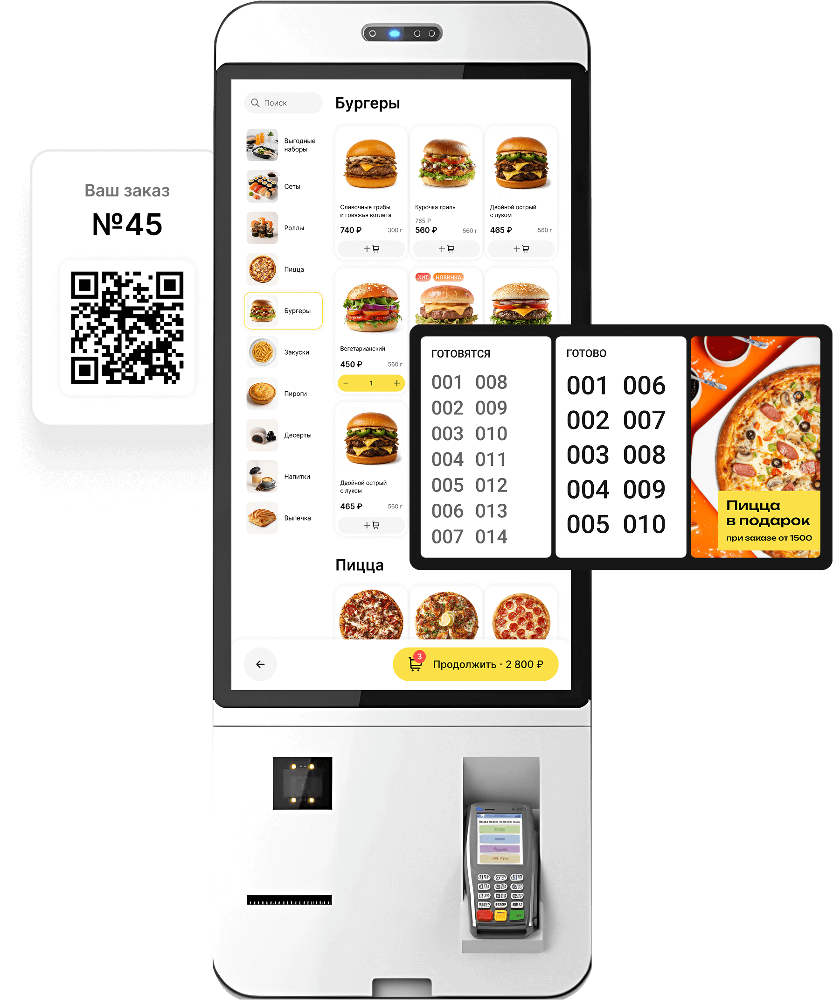

*Рисунок 8 – Киоск самообслуживания и электронная очередь приложения «Yama»*

<!-- fig-id: fig-09 -->
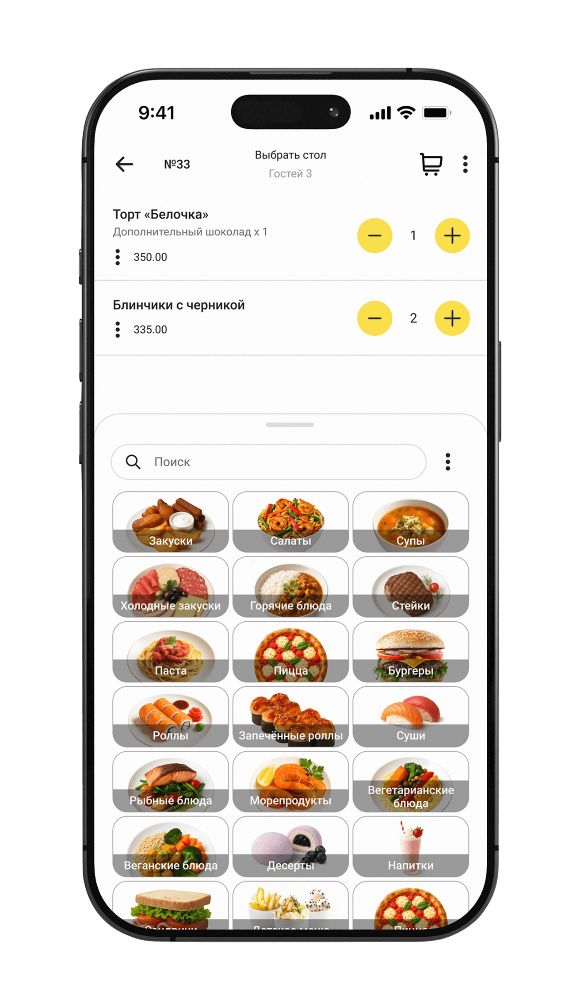

*Рисунок 9 – интерфейс для официантов в «Yama»*

К достоинствам данной системы относятся:

- маркетинговая направленность;

- интеграция с агрегаторами;

- современный интерфейс.

К недостаткам системы относятся:

- зависимость от внешних сервисов;

- ограниченная кастомизация;

- требовательность к инфраструктуре.

##### Облачная платформа для автоматизации ресторанного бизнеса «Restik»

Restik – это облачная платформа для автоматизации ресторанного бизнеса, объединяющая POS-терминал, конструктор сайта доставки, QR-меню и CRM-инструменты в едином интерфейсе. Система ориентирована на быстрый старт: подключение занимает около 15 минут без сложной настройки оборудования и обучения персонала [8]. На рисунке 10 приведена главная экранная форма приложения «Restik», на которой изображен обзор, цены и функционал. На рисунке 11 изображен экран, где показан функционал приложения для работы официанта с возможностью выбора блюд и подсчетом стоимости заказа. На рисунке 12 подробно продемонстрирован интерфейс приложения, где представлены занятые и свободные столики, количество человек, сидящих за ними, а также автоматически созданные чеки с каждого заказа.

<!-- fig-id: fig-10 -->
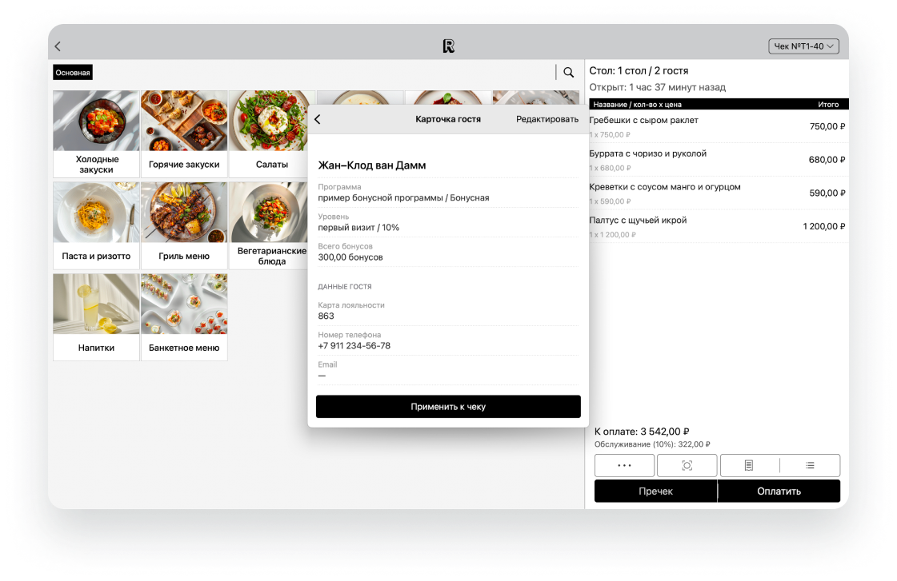

*Рисунок 10 – Экранная форма веб-приложения «Restik»*

<!-- fig-id: fig-11 -->
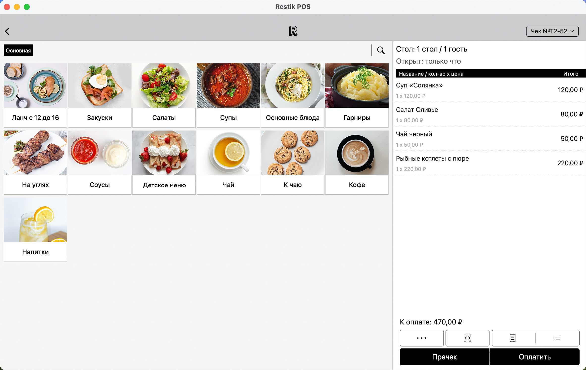

*Рисунок 11 – Функционал для официанта в приложении «Restik»*

<!-- fig-id: fig-12 -->
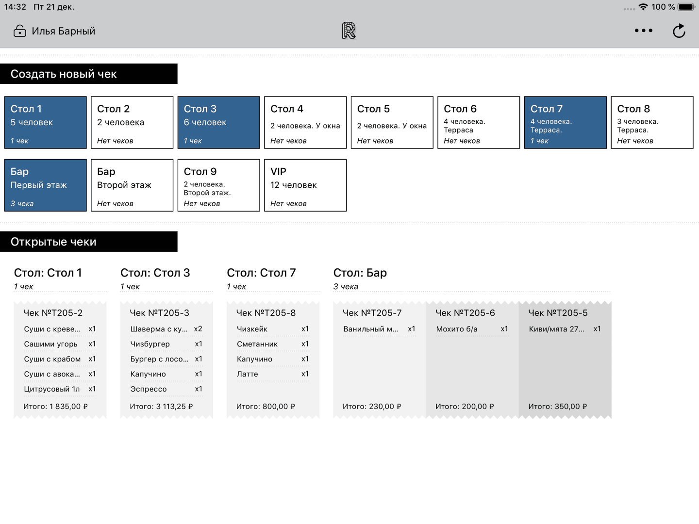

*Рисунок 12 – Интерфейс приложения «Restik»*

К достоинствам данной системы относятся:

- простота и скорость внедрения;

- комплексное решение «всё в одном»;

- работа без интернета;

- прозрачное ценообразование.

К недостаткам системы относятся:

- ограниченная глубина аналитики;

- зависимость от облака;

- меньше интеграций.

На основании анализа возможностей систем-аналогов были сформулированы требования к разрабатываемой системе (см. таблицу 2).

Таблица 2 – Сравнительные характеристики систем-аналогов

| Название системы

Название показателя | «IikoWeb» | «YUMA» | «Restik» | Разрабатываемая система |
| --- | --- | --- | --- | --- |
| Интерактивное меню с фото и описанием блюд | – | + | + | + |
| Управление несколькими адресами доставки (1-4) | – | + | – | + |
| Отслеживание статуса заказа в реальном времени | – | + | + | + |
| История заказов с функцией повтора | + | + | + | + |
| Наглядное управление статусами доставки | – | + | – | + |
| Персонализация под 4 роли пользователей | – | – | – | + |
| Мониторинг активности и статусов курьеров | – | + | – | + |

#### Диаграмма объектов предметной области

Объектный подход к проектированию – подход, при котором в первую очередь выделяется множество основных объектов системы и впоследствии определяется множество операций над объектами. Объектный подход к проектированию базируется на абстрактных типах, и решение задачи выражается в терминах выделенных объектов.

Методология ООАП (объектно-ориентированного анализа и проектирования) – это методология, которая включает два этапа [9]:

объектно-ориентированный анализ (ООА). На этапе анализа изучаются требования к системе, выделяются ключевые сущности (объекты) и определяются их основные свойства и поведение. Этот этап помогает создать модель предметной области, которая отражает реальные процессы и объекты;

объектно-ориентированное проектирование (ООП). Проектирование фокусируется на деталях реализации, определяя, как объекты из модели анализа будут взаимодействовать в программной среде. На этом этапе разрабатываются UML-диаграммы, такие как диаграммы классов, последовательностей и взаимодействия.

Объектная декомпозиция – это разделение системы на части, соответствующие объектам предметной области.

Объект – это предмет или явление (сущность), обладающее определёнными свойствами (характеристиками), способностью совершать действия и способностью реагировать на происходящие события [10].

На рисунке 13 приведена диаграмма объектов предметной области.

Основные характеристики объектов системы:

- ресторан, который включает в себя службу доставки еды – корневой объект, объединяющий все компоненты системы: клиентов, меню и сотрудников;

- у каждого клиента есть свой адрес, на который он может сделать заказ;

- меню состоит из блюд, которые в свою очередь включают в себя различные ингредиенты;

- курьер и менеджер являются сотрудниками, которыми управляет администратор.

- База данных – внешнее хранилище данных, обеспечивающее целостность и сохранность информации о всех объектах системы.

<!-- fig-id: fig-13 -->
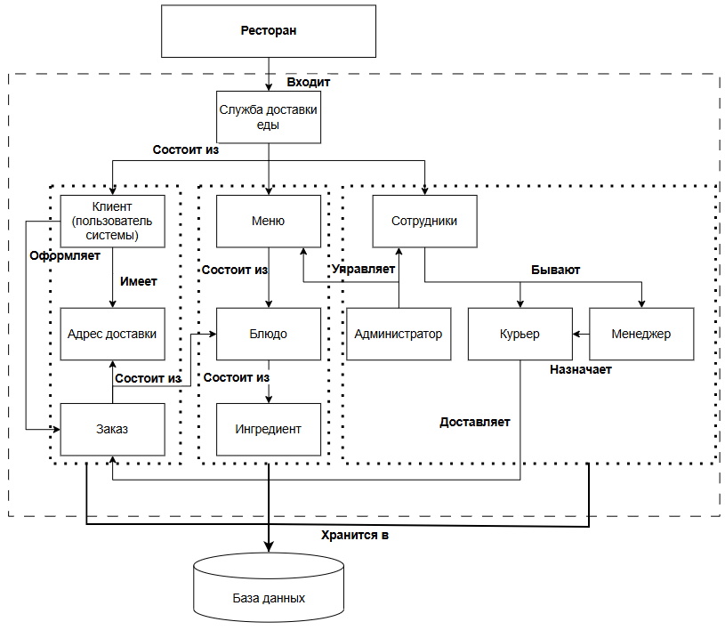

*Рисунок 13 – Диаграмма объектов предметной области*

#### Постановка задачи

Во время курсового проектирования необходимо разработать автоматизированную систему для удаленного создания заказов в системе ресторана и контроля их исполнения. Система позволит пользователю формировать заказ через веб-интерфейс, передавать данные на кухню в реальном времени и отслеживать статусы приготовления блюд на всех этапах выполнения заказа. Система должна быть реализована в виде веб-приложения.

В системе будет предусмотрено четыре роли пользователей: администратор, менеджер, курьер и клиент. Администратор, менеджер и курьер должны авторизоваться в системе с помощью ввода логина и пароля. Для обеспечения безопасности и корректной работы системы будут введены ограничения на вводимые данные: длина логина (от 4 до 16 символов), длина пароля (также будет составлять от 4 до 16 символов).

##### Режим администратора

Администратор системы будет осуществлять управление сотрудниками и меню ресторана. Администратор сможет просматривать список сотрудников, добавлять новых пользователей системы, редактировать их данные и удалять их при необходимости. Кроме того, администратор будет управлять меню ресторана: добавлять блюда, изменять информацию о них и удалять их из базы данных. В меню будет не более ста позиций.

При формировании карточки блюда будут заданы ограничения на характеристики блюда: длина названия блюда (от 2 до 100 символов), названия ингредиентов (также будут иметь ограничения: от 2 до 100 символов), количество ингредиентов в одном блюде (должно находиться в диапазоне от 2 до 16), вес блюда (будет задаваться в пределах от 10 до 1000 граммов, а калорийность – от 10 до 4000 килокалорий), описание блюда не более 1000 символов. Для каждого блюда должны быть добавлены фотографии (от 1 до 4). Стоимость одного блюда от 50 до 10 000 рублей.

##### Режим менеджера

Менеджер ресторана будет работать с поступающими заказами. Система позволит получать список заказов по статусам, контролировать процесс их выполнения и назначать заказы курьерам. Менеджер также сможет отслеживать статус курьеров и отменять заказ по требованию клиента.

##### Режим курьера

Курьер будет получать назначенные ему заказы через систему после авторизации. Он сможет изменять свой рабочий статус (работает/не работает) на текущий день, принимать заказы к доставке и изменять статус заказа после выполнения доставки. Информация о ходе выполнения заказа будет передаваться менеджеру для мониторинга.

##### Режим клиента

Клиент системы сможет регистрироваться и авторизовываться в системе, редактировать персональные данные и управлять списком адресов доставки. Количество адресов не более 4. Пользователь сможет просматривать интерактивное меню ресторана, открывать карточки блюд и выбирать необходимое количество порций. В состав заказа будет входить до 8 блюд (до порций 16). После выбора блюд система будет автоматически рассчитывать полную стоимость заказа. Клиент также сможет отслеживать статус заказа, подтверждать получение, отменять заказ, просматривать историю заказов и оставлять отзывы.

##### Система

Система также будет обеспечивать хранение информации о заказах, подтверждениях доставки и отзывах клиентов. Пользователям будет предоставлена справочная информация о работе системы, а также реализован контроль операций с базой данных.

Таким образом, система должна решать следующие задачи:

функции системы:

аутентификация пользователей;

разграничение прав доступа при работе с базой данных в зависимости от роли;

формирование и визуализация интерактивного меню блюд;

визуализация карточки конкретного блюда;

расчет полной стоимости заказа с учетом количества порций;

управление жизненным циклом заказа;

сбор и хранение отзывов и подтверждений доставки;

выдача справочной информации о системе;

контроль работы с БД;

функции администратора:

авторизация в системе (ввод логина и пароля);

управление сотрудниками:

получение списка сотрудников;

добавление нового сотрудника;

редактирование учетных данных;

удаление сотрудника из системы;

управление меню:

получение меню (списка блюд);

добавление блюд в меню;

редактирование блюда;

удаление блюд из меню;

просмотр справочной информации;

функции менеджера:

авторизация в системе (ввод логина и пароля);

получение заказов по статусам;

получение статусов курьеров:

назначение заказа курьеру;

отмена заказа по требованию клиента;

просмотр справочной информации;

функции курьера:

авторизация в системе;

управление статусом;

получение назначенных заказов;

изменение статуса заказа с сообщением менеджеру;

просмотр справочной информации;

функции клиента:

регистрация в системе (ввод логина и пароля);

авторизация в системе (ввод логина и пароля);

редактирование персональных данных;

управление списком адресов доставки;

просмотр истории заказов;

повтор завершённого заказа;

просмотр меню;

выбор блюд из меню с указанием количества порций;

выбора адреса и времени доставки;

оформление заказа;

подтверждение о получении или отмена текущего заказа;

просмотр справочной информации.
