# Проектирование системы

Проектирование системы – это процесс определения структуры, функций, данных, связей и правил работы будущей системы до начала программной реализации [10].

На этапе проектирования системы необходимо определить основные принципы построения программного решения и подготовить его к дальнейшей реализации. В процессе проектирования будет выполнен анализ требований, определена структура системы, а также разработаны основные компоненты и механизмы взаимодействия пользователей с системой.

На данном этапе жизненного цикла будут решены следующие задачи:

- анализ и уточнение требований к разрабатываемой системе;

- определение общей архитектуры системы;

- проектирование структуры базы данных;

- определение ролей пользователей и разграничение прав доступа;

- разработка логики работы системы удалённого оформления заказов;

- проектирование пользовательского интерфейса системы;

- проектирование механизма обработки и мониторинга заказов;

- разработка алгоритмов взаимодействия менеджеров и курьеров при доставке.

#### Выбор и обоснование архитектуры системы

Архитектура программной системы представляет собой совокупность основных решений, определяющих структуру системы, её компоненты, способы их взаимодействия и принципы организации работы. Архитектура описывает, из каких частей состоит система, как эти части взаимодействуют между собой и каким образом обеспечивается выполнение всех требуемых функций [11].

- Существует несколько основных видов архитектуры программных систем.

- Клиент-серверная архитектура – модель построения информационной системы, при которой приложение разделено на две части: клиентскую и серверную. Клиент отвечает за взаимодействие с пользователем и отправляет запросы, а сервер принимает эти запросы, обрабатывает их, работает с базой данных и возвращает результат. Данная архитектура широко используется при разработке веб-сервисов и информационных систем.

- Монолитная архитектура – способ построения программного обеспечения, при котором все компоненты системы объединены в одно приложение. Интерфейс пользователя, бизнес-логика и работа с данными находятся внутри единой программы и работают как единое целое. Такая архитектура отличается простотой разработки и развертывания.

- Микросервисная архитектура – подход, при котором система состоит из набора независимых сервисов. Каждый сервис выполняет отдельную функцию и может разрабатываться, обновляться и масштабироваться независимо от других. Такой подход используется в крупных распределённых системах.

- Для систем, работающих через сеть, часто применяется клиент-серверная архитектура. В рамках данной модели существует несколько вариантов организации взаимодействия.

- Двухзвенная архитектура включает два основных уровня:

- клиентское приложение;

- сервер, который одновременно выполняет обработку данных и работу с базой данных.

- В такой архитектуре (представленной на рисунке 14) клиент отправляет запросы напрямую на сервер, а сервер выполняет всю логику обработки и возвращает результат.

- В данной модели клиент взаимодействует с сервером приложений, который обрабатывает запросы и обращается к базе данных. Такой подход повышает масштабируемость системы и облегчает её сопровождение.

<!-- fig-id: fig-14 -->
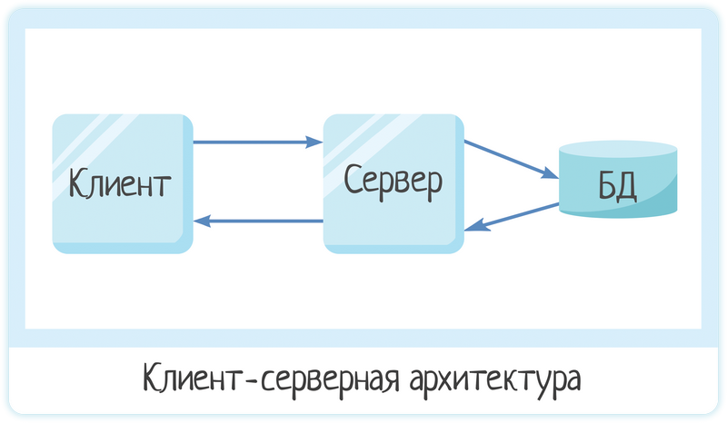

*Рисунок 14 – Двухзвенная архитектура*

- Разрабатываемая система удалённого создания заказов будет реализована в виде веб-приложений. Веб-приложение – это программная система, доступ к которой осуществляется через веб-браузер по сети интернет или локальной сети. Пользователь взаимодействует с системой через интерфейс веб-страницы, а обработка данных выполняется на сервере [12].

- Обмен данными между клиентом и сервером осуществляется с использованием сетевых протоколов. Протокол — это набор правил, определяющих формат и порядок передачи данных между устройствами в сети [13].

- Наиболее распространённым протоколом для веб-приложений является HTTP (HyperText Transfer Protocol). Он используется для передачи данных между клиентом и сервером. Клиент отправляет HTTP-запрос, содержащий необходимую информацию, а сервер обрабатывает его и возвращает HTTP-ответ. Для повышения безопасности часто используется протокол HTTPS, который обеспечивает шифрование передаваемых данных.

- Также в информационных системах выделяют различные типы клиентов [14].

- “Толстый” клиент – это приложение, в котором значительная часть обработки данных выполняется на стороне пользователя. Такие программы устанавливаются на компьютер пользователя и могут работать с сервером только для обмена данными.

- “Тонкий” клиент – это приложение, в котором основная обработка данных выполняется на сервере. Пользователь взаимодействует с системой через веб-браузер или простое клиентское приложение. Такой подход снижает требования к устройствам пользователей и упрощает обновление системы.

- Разрабатываемая система удалённого создания заказов будет реализована как веб-приложение с использованием клиент-серверной архитектуры. В системе будет применяться двухзвенная архитектура. Взаимодействие между клиентом и сервером будет осуществляться по протоколу HTTP/HTTPS. В качестве клиента будет использоваться “тонкий” клиент – веб-браузер пользователя.

#### Структурная схема системы

Сущность структурного подхода к разработке информационных систем заключается в представлении сложной системы в виде иерархической структуры взаимосвязанных компонентов. При использовании данного подхода система последовательно декомпозируется, то есть разбивается на более простые части. Сначала выделяются основные функциональные подсистемы, затем они разделяются на подфункции, далее — на отдельные задачи и процедуры. Такое поэтапное разбиение продолжается до тех пор, пока каждая часть системы не станет достаточно простой для анализа и реализации.

Декомпозиция позволяет упростить процесс проектирования, так как разработка системы осуществляется по принципу «от общего к частному». При этом сохраняется целостность системы, поскольку все её элементы взаимосвязаны и направлены на выполнение общей задачи. Структурный подход также способствует повышению наглядности проектируемой системы и облегчает её дальнейшее развитие и сопровождение.

Система в общем случае представляет собой совокупность взаимосвязанных элементов, находящихся в отношениях и образующих единое целое. [?] Эти элементы взаимодействуют между собой для достижения определённой цели и выполнения заданных функций. В контексте информационных систем такими элементами являются программные компоненты, данные, технические средства и пользователи системы.

На рисунке 15 приведена структурная схема разрабатываемой системы, в ее состав входят следующие подсистемы:

1. подсистема пользовательского интерфейса, которая отвечает за отображение информации пользователю, включая визуализацию меню, отображение корзины, карточек блюд и текущего статуса заказа;

1. подсистема взаимодействия с серверной частью, которая обеспечивает обмен данными между клиентской и серверной частями системы посредством HTTP-запросов и передачу данных в формате JSON;

1. подсистема ввода данных, которая отвечает за ввод и обработку пользовательских данных, включая регистрацию и авторизацию пользователей, оформление заказов и управление личным кабинетом;

1. справочная подсистема, которая предоставляет пользователям информацию о работе системы и справочные материалы;

1. подсистема контроллеров, которая принимает HTTP-запросы от клиентской части системы, обрабатывает их и передаёт соответствующим компонентам серверной части;

1. подсистема взаимодействия с клиентской частью, которая обеспечивает обработку запросов от клиентов и формирование ответов, передаваемых обратно в клиентское приложение;

1. подсистема бизнес-логики, которая реализует основные функциональные возможности системы и обеспечивает обработку данных и выполнение операций над ними;

1. подсистема авторизации пользователей, которая выполняет проверку учетных данных пользователей и обеспечивает управление доступом к функциям системы;

1. подсистема управления меню, которая отвечает за формирование и редактирование меню блюд, а также за хранение и обновление информации о блюдах;

1. подсистема обработки заказов, которая обеспечивает создание, изменение и контроль состояния заказов пользователей;

1. подсистема управления пользователями, которая отвечает за хранение и обработку информации о пользователях системы;

1. подсистема управления доставкой, которая обеспечивает назначение заказов курьерам и контроль процесса доставки;

1. подсистема работы с базой данных, которая обеспечивает хранение и обработку данных системы, включая информацию о пользователях, блюдах, заказах и доставках.

<!-- fig-id: fig-15 -->
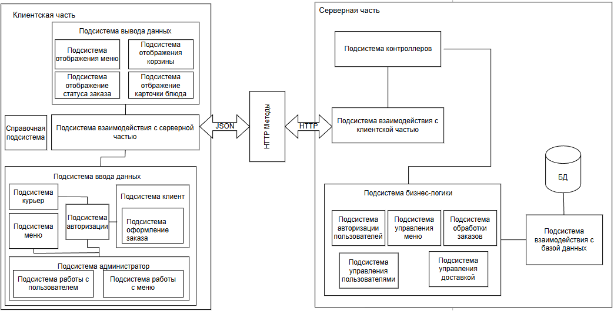

*Рисунок 15 – Структурная схема системы*

#### Разработка прототипа интерфейса пользователя системы

Пользовательский интерфейс (user interface) – это совокупность программных и аппаратных средств, обеспечивающих взаимодействие пользователя с системой. Интерфейс определяет способы отображения информации, ввода данных и управления функциями приложения. Качество интерфейса напрямую влияет на удобство работы с системой и скорость освоения её возможностей пользователями [16].

При проектировании пользовательского интерфейса будут учитываться принципы удобства использования: последовательность и предсказуемость элементов управления, минимизация действий для достижения цели, визуальная иерархия информации и своевременная обратная связь. Разработка прототипов страниц позволит заблаговременно выявить проблемы в организации интерфейса до начала программной реализации, согласовать функциональность с требованиями заинтересованных сторон и снизить затраты на последующие доработки.

Система будет состоять из двух типов клиентских веб-приложений: десктопное веб-приложение для сотрудников ресторана (администратор, менеджер, курьер), работающее через браузер на настольном компьютере, и мобильное веб-приложение для клиентов, оптимизированное под экраны смартфонов. В данном разделе будут разработаны прототипы страниц обоих приложений.

##### Разработка прототипа интерфейса сотрудника ресторана

Интерфейс сотрудника ресторана будет представлять собой веб-приложение с боковой панелью навигации и областью основного содержимого. Доступ к приложению будет осуществляться через страницу авторизации с вводом адреса электронной почты и пароля. Приложение будет адаптировано под различные роли: администратор, менеджер и курьер.

На рисунке 16 приведён прототип страницы входа в систему. Страница будет разделена на две части: левая будет содержать логотип приложения Food Rush и вдохновляющую цитату о еде, правая — форму авторизации с полями ввода адреса электронной почты и пароля, а также кнопку «Войти». В правом верхнем углу будет расположена ссылка на страницу регистрации нового клиента.

<!-- fig-id: fig-16 -->
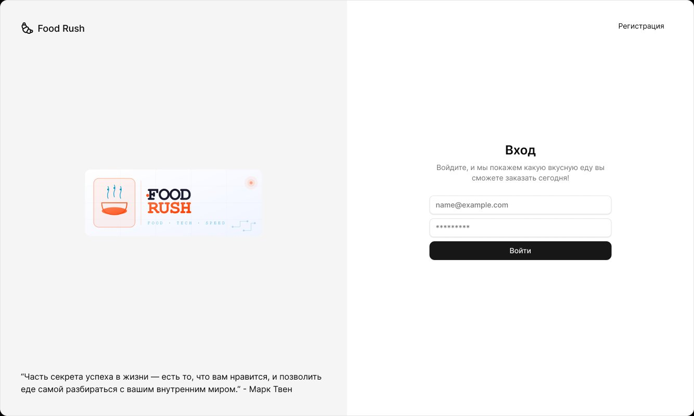

*Рисунок 16 – Прототип страницы входа в систему*

На рисунке 17 приведён прототип формы входа с ошибкой авторизации.

<!-- fig-id: fig-17 -->
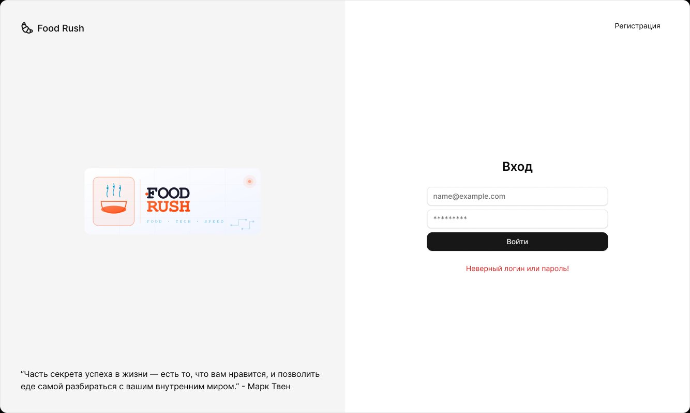

*Рисунок 17 – Прототип формы входа с ошибкой авторизации*

При вводе неверных учётных данных под формой входа будет отображаться сообщение об ошибке «Неверный логин или пароль!», выделенное красным цветом. Такая обратная связь обеспечит понятную индикацию ошибок ввода для пользователя.

На рисунке 18 приведён прототип страницы «Меню» административной панели с открытым модальным окном редактирования. Страница будет состоять из двух областей: фиксированного бокового навигационного меню и основной рабочей области.

<!-- fig-id: fig-18 -->
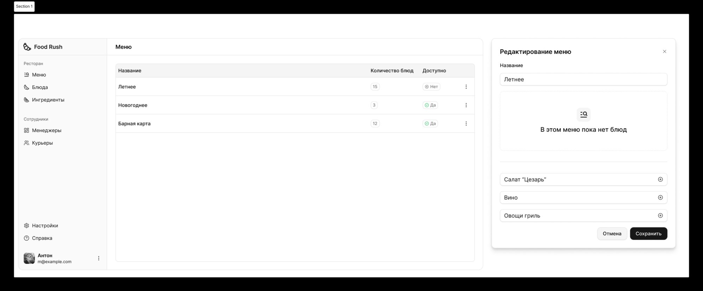

*Рисунок 18 – Прототип страницы управления меню*

Боковое навигационное меню будет включать логотип приложения Food Rush, две группы навигационных ссылок, а также служебные пункты. Группа «Ресторан» будет содержать разделы «Меню», «Блюда» и «Ингредиенты», предназначенные для управления содержимым ресторана. Группа «Сотрудники» будет содержать разделы «Менеджеры» и «Курьеры» для управления персоналом. В нижней части бокового меню будут расположены пункты «Настройки» и «Справка». Раздел «Настройки» предназначен для управления параметрами учётной записи и конфигурации системы. Раздел «Справка» предоставит пользователю информацию о работе с приложением. Также в нижней части будет отображаться карточка текущего авторизованного пользователя с его именем и адресом электронной почты.

Основная рабочая область будет отображать таблицу меню с колонками «Название», «Количество блюд» и «Доступно». В конце каждой строки таблицы будет расположена кнопка дополнительного меню ⋮ , при нажатии на которую будет появляться контекстное меню с действиями над записью, включая возможность удаления сущности.

Модальное окно «Редактирование меню» будет вызываться при выборе конкретной записи из таблицы и позволит администратору изменить название меню, добавить блюда из списка и сохранить изменения. Модальные окна в прототипе изображены рядом с таблицей для наглядности; в реализованном приложении они будут открываться поверх содержимого страницы.

На рисунке 19 приведён прототип страницы «Блюда» с открытым модальным окном редактирования. Таблица блюд будет содержать колонки «Название», «Стоимость» и «Количество ингредиентов». Модальное окно редактирования будет включать поля для ввода названия, веса, калорийности, стоимости и описания, а также список ингредиентов с возможностью добавления из существующего списка.

<!-- fig-id: fig-19 -->
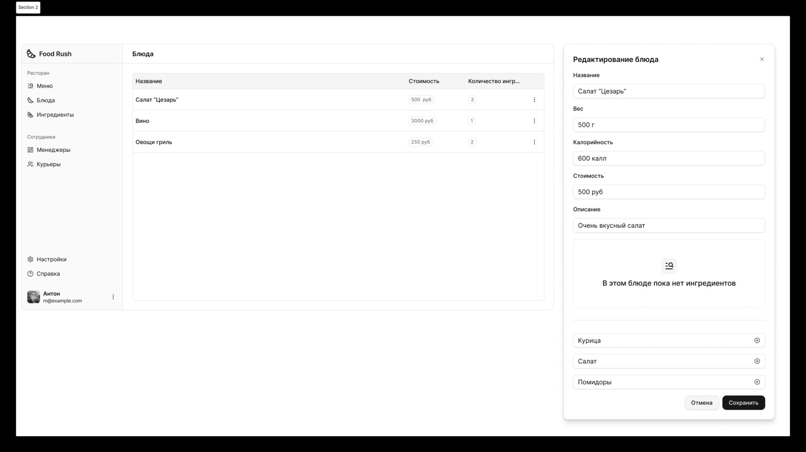

*Рисунок 19 – Прототип страницы управления блюдами*

На рисунке 20 приведён прототип страницы «Курьеры». Слева будет располагаться навигационное меню с группами «Ресторан» и «Сотрудники». Справа будет отображаться таблица курьеров с колонками «Фамилия», «Телефон» и «Статус». Статус будет отображаться цветными метками: зелёный кружок «Работает» и серый значок «Выходной». Модальное окно редактирования будет позволять изменять анкетные данные курьера.

<!-- fig-id: fig-20 -->
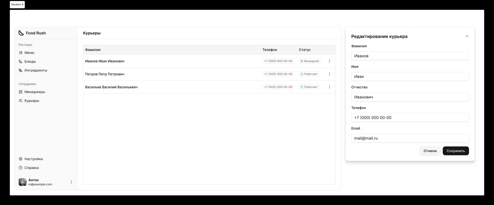

*Рисунок 20 – Прототип страницы управления курьерами*

На рисунке 21 приведён прототип страницы «Менеджеры». Страница будет иметь аналогичную структуру со страницей управления курьерами. Таблица менеджеров будет содержать колонки «Фамилия» и «Телефон». Модальное окно редактирования будет позволять изменять анкетные данные менеджера, включая фамилию, имя, отчество, номер телефона и Email.

<!-- fig-id: fig-21 -->
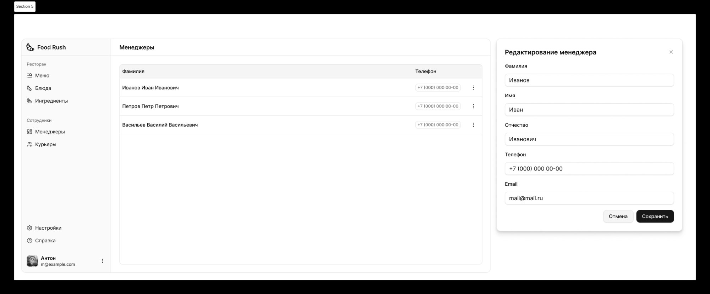

*Рисунок 21 – Прототип страницы управления менеджерами*

На рисунке 22 приведён прототип страницы «Заказы» интерфейса менеджера с открытым модальным окном редактирования. Страница будет состоять из боковой навигационной панели и основной рабочей области. В боковом меню под логотипом Food Rush будут располагаться группа «Ресторан» с разделом «Заказы», а также пункты «Настройки» и «Справка». В нижней части будет отображаться карточка авторизованного сотрудника.

<!-- fig-id: fig-22 -->
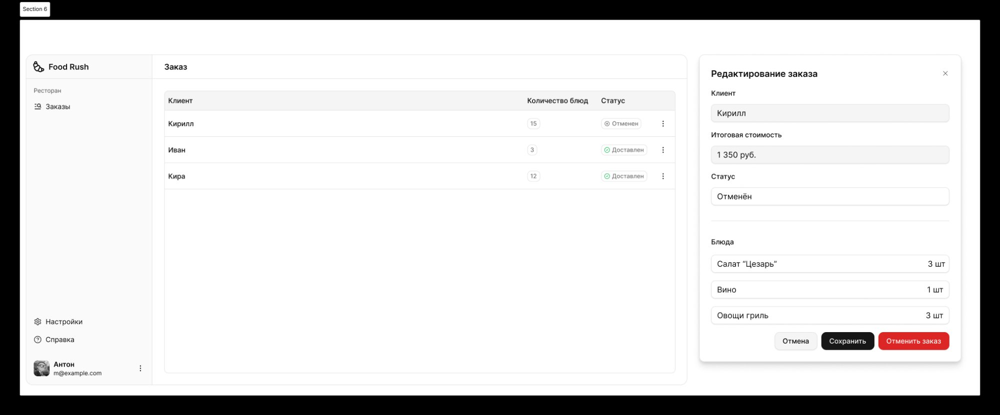

*Рисунок 22 – Прототип страницы управления заказами (менеджер)*

Основная рабочая область будет отображать таблицу заказов с колонками «Клиент», «Количество блюд» и «Статус». Статус заказа будет визуально обозначаться цветными метками: серый значок «Отменён» и зелёный значок «Доставлен». В конце каждой строки таблицы будет расположена кнопка контекстного меню ⋮, при нажатии на которую будет появляться контекстное меню с действиями над записью.

Модальное окно «Редактирование заказа» будет вызываться при выборе конкретного заказа из таблицы. Окно будет отображать поля «Клиент», «Итоговая стоимость» и «Статус» в режиме только для чтения, а также список блюд с указанием количества порций. В нижней части модального окна будут расположены кнопки «Отмена», «Сохранить» и «Отменить заказ», позволяющие менеджеру управлять состоянием заказа по требованию клиента. Модальные окна в прототипе изображены рядом с таблицей для наглядности; в реализованном приложении они будут открываться поверх содержимого страницы.

##### Разработка прототипа интерфейса курьера

Мобильное веб-приложение для курьера будет оптимизировано под экраны смартфона. В отличие от остальных сотрудников ресторана, курьер будет работать не с десктопной, а с мобильной версией приложения, поскольку его деятельность осуществляется вне стационарного рабочего места. Навигация между разделами будет реализована через нижнюю панель с двумя вкладками: «Заказы» и «Профиль».

На рисунке 23 приведён прототип главной страницы «Мои заказы». В верхней части страницы будет располагаться переключатель рабочего статуса курьера «Статус: работаю» с тумблером включения и отключения. Ниже будет отображаться список назначенных заказов в виде карточек. Каждая карточка будет содержать номер заказа, адрес доставки, количество блюд, итоговую сумму и цветную метку текущего статуса: оранжевую «В пути», зелёную «Доставлен» или синюю «Назначен».

<!-- fig-id: fig-23 -->
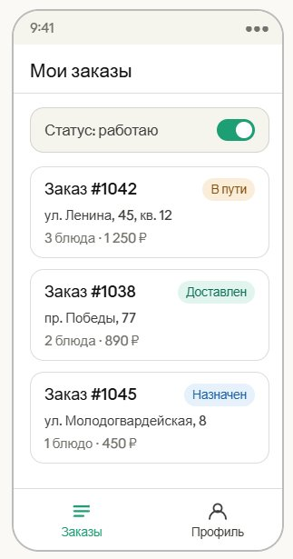

*Рисунок 23 – Прототип страницы списка заказов курьера*

На рисунке 24 приведён прототип страницы детального просмотра заказа. Страница будет отображать адрес доставки, имя клиента и текущий статус заказа в виде цветной метки. Ниже будет представлен состав заказа: список блюд с указанием количества порций и итоговая сумма. В нижней части страницы будет располагаться вертикальная шкала статусов с тремя этапами: «Принят», «В пути» и «Доставлен». Текущий активный этап будет выделен цветом. Под шкалой будет находиться кнопка перехода к следующему статусу.

<!-- fig-id: fig-24 -->
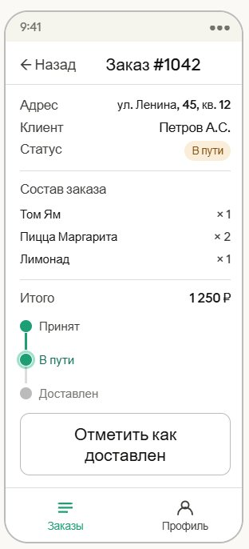

*Рисунок 24 – Прототип страницы карточки заказа курьера*

На рисунке 25 приведён прототип экрана подтверждения смены статуса заказа. Данный экран будет появляться после нажатия кнопки изменения статуса на странице карточки заказа. Экран будет содержать визуальный индикатор успешного действия, номер заказа и текстовое пояснение выполняемой операции. Ниже будет отображаться сводная информация о заказе: адрес, имя клиента и итоговая сумма. Подтверждение смены статуса потребует нажатия кнопки «Подтвердить доставку», отмена действия — нажатия кнопки «Отмена». После подтверждения статус заказа будет обновлён в системе и передан менеджеру для мониторинга.

<!-- fig-id: fig-25 -->
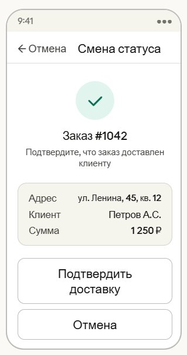

*Рисунок 25 – Прототип экрана подтверждения смены статуса заказа*

На рисунке 26 приведён прототип страницы «Профиль». В верхней части страницы будут отображаться аватар с инициалами курьера, его полное имя и контактный телефон. Ниже будет располагаться переключатель рабочего статуса «На смене сегодня», дублирующий соответствующий элемент управления со страницы списка заказов. Раздел «Аккаунт» будет содержать пункт «Личные данные» для просмотра анкетных данных. Раздел «Прочее» будет включать пункты «Справка» и «О приложении». В нижней части страницы будет расположена кнопка «Выйти из аккаунта».

<!-- fig-id: fig-26 -->
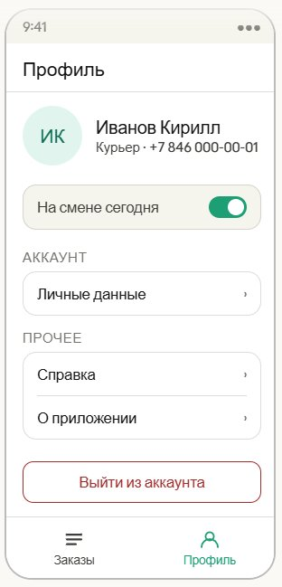

*Рисунок 26 – Прототип страницы профиля курьера*

##### Разработка прототипа интерфейса клиента ресторана

Мобильное веб-приложение для клиента будет оптимизировано под экраны смартфона и будет включать четыре основных раздела: «Меню», «Корзина», «Заказы» и «Профиль», доступные через нижнюю навигационную панель.

На рисунке 27 приведён прототип страницы «Меню» веб-приложения. Вверху будут расположены вкладки для переключения между различными меню (Летнее, Новогоднее, Барная карта). Список блюд будет отображаться в виде карточек с иконкой блюда, его названием, кратким составом, ценой и элементами управления количеством порций. В нижней части страницы будет фиксироваться кнопка «Перейти в корзину» с указанием количества добавленных блюд.

<!-- fig-id: fig-27 -->
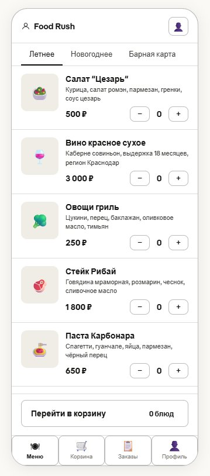

*Рисунок 27 – Прототип страницы просмотра меню*

На рисунке 28 приведён прототип страницы карточки блюда. На странице будут отображаться фотография блюда, его название и описание, характеристики (вес, калории, стоимость, количество ингредиентов), состав блюда в виде тегов ингредиентов. В нижней части страницы будет расположен блок выбора количества порций и кнопка «В корзину».

<!-- fig-id: fig-28 -->
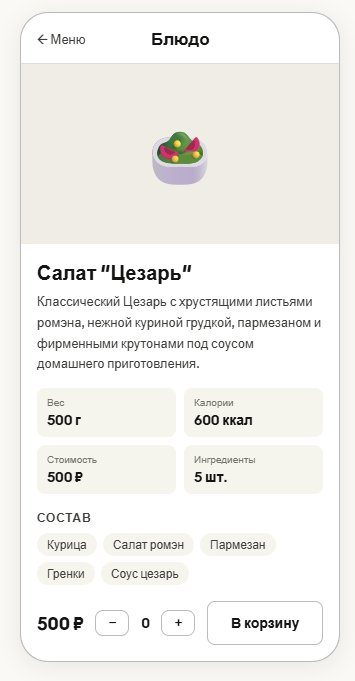

*Рисунок 28 – Прототип страницы карточки блюда*

На рисунке 29 приведён прототип страницы истории заказов. Каждый заказ будет отображаться в отдельной карточке с номером, датой и временем, цветной меткой статуса («В пути» — оранжевый, «Доставлен» — зелёный, «Отменён» — красный), списком блюд и итоговой суммой. Для активного заказа будет отображаться кнопка «Отследить», для доставленного — кнопки «Оценить» и «Повторить», для отменённого — кнопка «Повторить».

<!-- fig-id: fig-29 -->
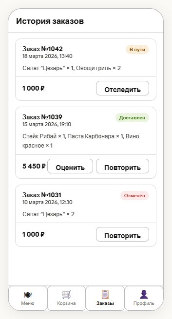

*Рисунок 29 – Прототип страницы истории заказов*

На рисунке 30 приведён прототип страницы отслеживания текущего заказа. Страница будет отображать пошаговую шкалу статусов: «Заказ принят», «Готовится», «Передан курьеру», «Курьер в пути» и «Доставлен». Текущий этап будет выделен цветом. Также будут отображаться имя и рейтинг курьера, а также кнопки «Подтвердить получение» и «Отменить заказ».

<!-- fig-id: fig-30 -->
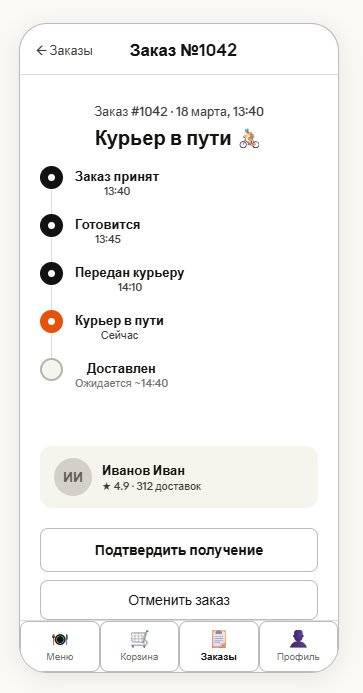

*Рисунок 30 – Прототип страницы отслеживания заказа*

На рисунке 31 приведён прототип страницы «Профиль». Страница будет отображать аватар и полное имя пользователя, адрес электронной почты, а также разделы: «Аккаунт» с пунктами «Личные данные» и «Адреса доставки», «Прочее» с пунктами «Справка» и «О приложении». В нижней части страницы будет расположена кнопка «Выйти из аккаунта».

<!-- fig-id: fig-31 -->
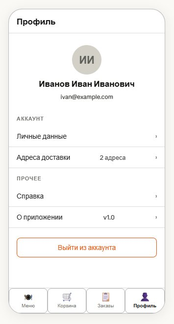

*Рисунок 31 – Прототип страницы профиля пользователя*

#### Разработка информационно-логического проекта системы

Навигационная модель системы описывает совокупность страниц приложения и допустимых переходов между ними в зависимости от роли пользователя. Она позволяет наглядно представить пользовательский путь (user flow) — последовательность действий, которую совершает пользователь при решении конкретной задачи в системе.

Разрабатываемая система будет поддерживать четыре роли: администратор, менеджер, курьер и клиент. Все роли будут проходить через единую точку входа — страницу авторизации. После успешной аутентификации система определит роль пользователя и перенаправит его в соответствующий раздел. Регистрация в системе будет доступна только для клиентов.

Сотрудники ресторана (администратор и менеджер) будут работать с десктопной версией веб-приложения, построенной по принципу единого рабочего пространства с боковым навигационным меню: разделы будут доступны независимо друг от друга, переход между ними не потребует соблюдения какой-либо последовательности. Курьер и клиент будут пользоваться мобильной версией приложения с нижней навигационной панелью.

Для каждой роли разработана отдельная навигационная модель. Сплошными стрелками обозначены прямые переходы вперёд по пользовательскому пути.

На рисунке 32 приведена навигационная модель интерфейса администратора. Десктопное приложение администратора будет построено по принципу единого рабочего пространства с боковым навигационным меню. Меню будет содержать группу «Ресторан» с разделами «Меню», «Блюда» и «Ингредиенты», а также группу «Сотрудники» с разделами «Менеджеры» и «Курьеры». В нижней части бокового меню будут расположены разделы «Настройки» и «Справка». Из каждого раздела будут открываться модальные окна редактирования и создания сущностей. Менеджер будет работать с аналогичным интерфейсом, содержащим только раздел «Заказы».

<!-- fig-id: fig-32 -->
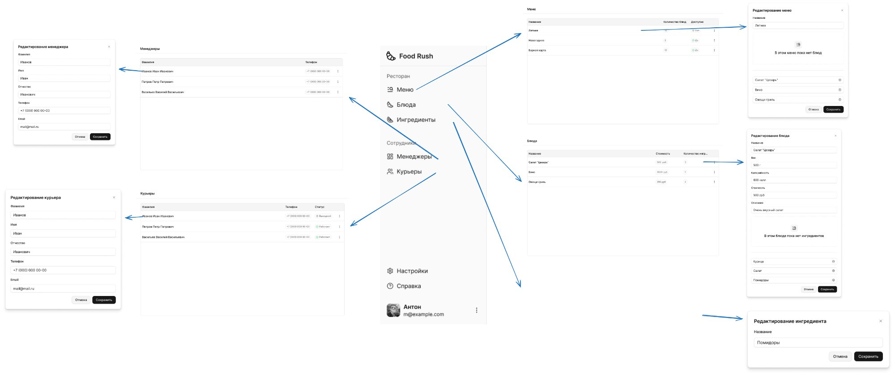

*Рисунок 32 – Навигационная модель интерфейса администратора*

На рисунке 33 приведена навигационная модель интерфейса курьера. Приложение курьера будет содержать две основные страницы, доступные через нижнюю навигационную панель: «Мои заказы» и «Профиль». Из списка заказов будет осуществляться переход на карточку конкретного заказа, откуда будет доступен экран подтверждения смены статуса. После успешного подтверждения курьер будет перенаправлен обратно на страницу списка заказов.

<!-- fig-id: fig-33 -->
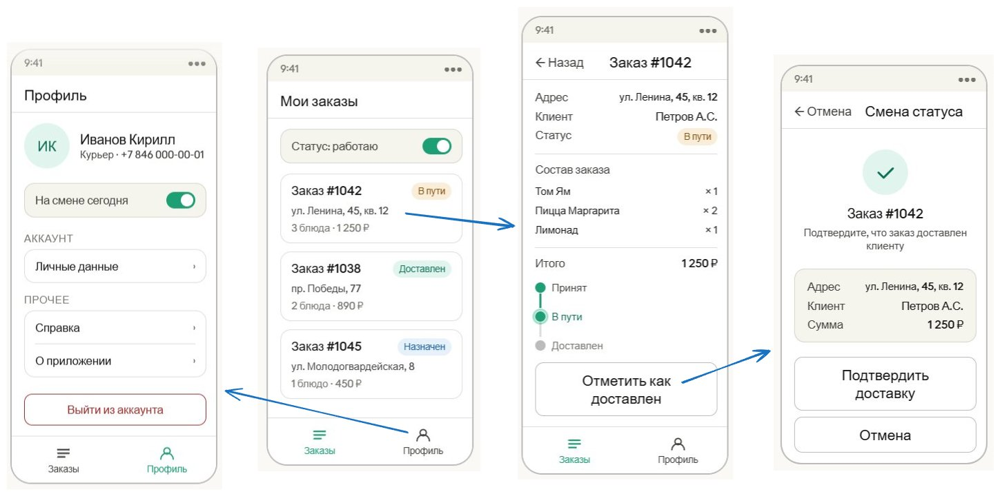

*Рисунок 33 – Навигационная модель интерфейса курьера*

На рисунке 34 приведена навигационная модель интерфейса клиента. Мобильное приложение клиента будет включать четыре раздела нижней навигационной панели: «Меню», «Корзина», «Заказы» и «Профиль». Из страницы меню будет осуществляться переход на карточку отдельного блюда с возможностью добавления его в корзину. Из раздела заказов будет доступен переход на страницу отслеживания активного заказа, откуда клиент сможет подтвердить получение или отменить заказ, а для завершённых заказов — оставить отзыв или повторить заказ.

<!-- fig-id: fig-34 -->
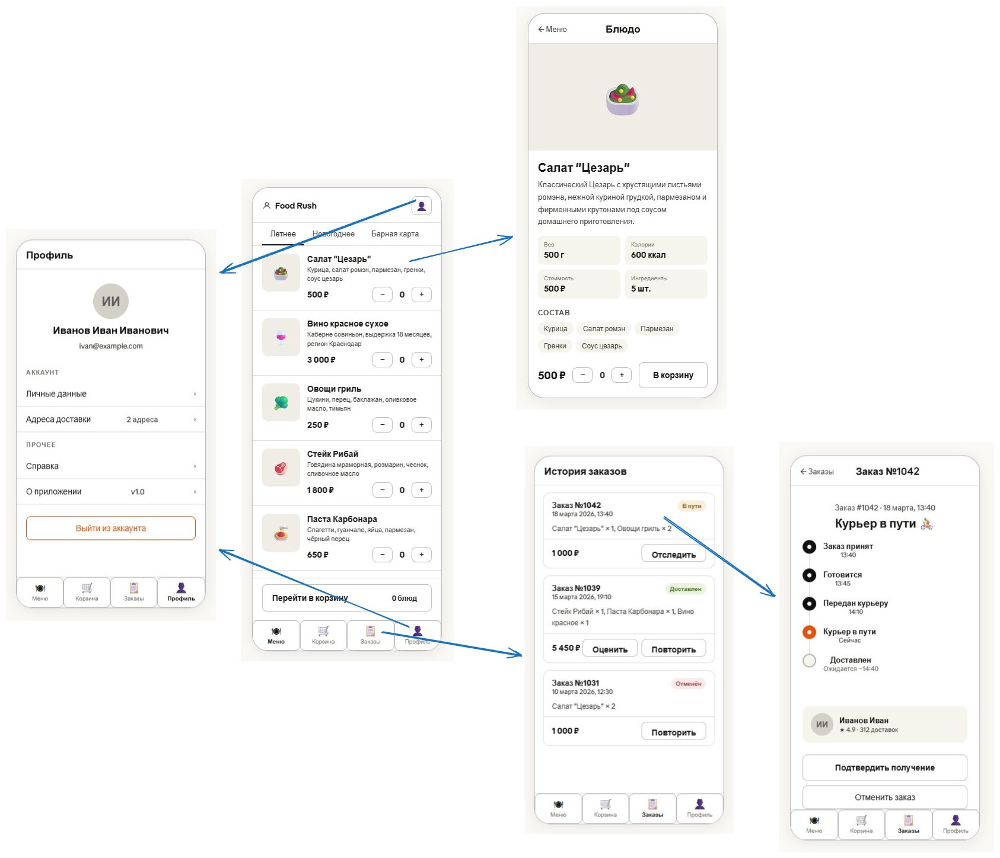

*Рисунок 34 – Навигационная модель интерфейса клиента*

##### Язык UML

Для специфицирования (построения точных, недвусмысленных и полных моделей) системы и ее документирования используется унифицированный язык моделирования UML. Он позволяет формализовать структуру и поведение системы с помощью набора графических нотаций, понятных как разработчикам, так и другим участникам проекта. Использование UML способствует улучшению коммуникации в команде, упрощает анализ требований и обеспечивает наглядное представление архитектуры и логики работы системы.

##### Диаграмма вариантов использования

Диаграмма вариантов использования представляет собой наиболее общую концептуальную модель сложной системы, которая является исходной для построения всех остальных диаграмм. На ней изображаются отношения между актерами и вариантами использования.

Диаграмма вариантов использования (Use Case Diagram) является одной из ключевых диаграмм UML и предназначена для отображения функциональных возможностей системы с точки зрения пользователя. Она описывает взаимодействие акторов с системой через набор вариантов использования, отражающих основные сценарии работы. Такая диаграмма помогает определить границы системы, выявить требования к функциональности и служит основой для дальнейшего проектирования и разработки [25].

<!-- fig-id: fig-35 -->
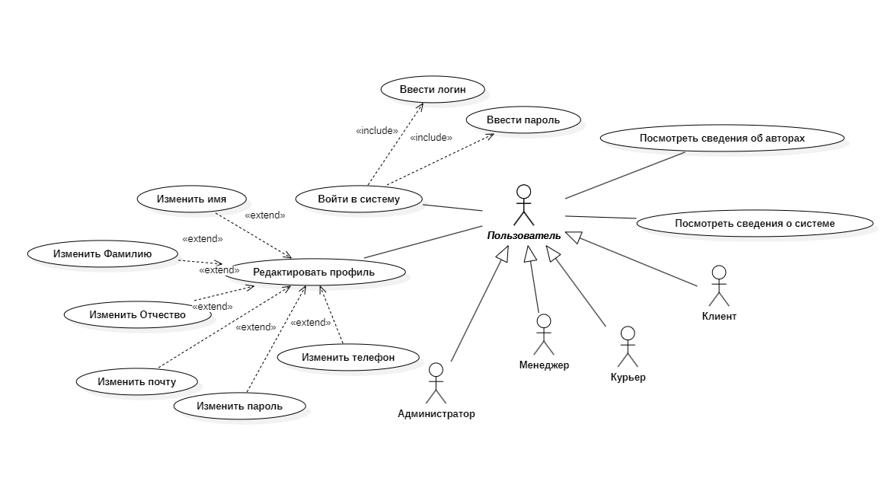

*Рисунок 35 – Диаграмма вариантов использования пользователя*

Для разрабатываемого приложения есть несколько ролей актера, поэтому мы ввели абстрактного актера – «Пользователь». У пользователя есть выбор действий, которые он может совершить: войти в систему, введя логин и пароль, редактировать свой профиль, изменяя имя, фамилию, отчество, почту, пароль или телефон, посмотреть сведения об авторах, посмотреть сведения о системе. Администратор, менеджер, курьер и клиент наследуют все возможности базового пользователя и могут выполнять те же действия.

Актер «Клиент». имеет выбор действий, которые он может совершить: работать с меню, просматривая его и открывая карточки блюд для выбора, изменения количества порций и добавления в корзину; работать с корзиной и оформлять заказ, в процессе которого необходимо выбрать адрес и время; работать с профилем, изменяя личные данные, выходя из аккаунта или управляя адресами доставки (добавляя или удаляя их); просматривать историю заказов, а также отслеживать текущие заказы, при необходимости отменяя их или подтверждая получение.

<!-- fig-id: fig-36 -->
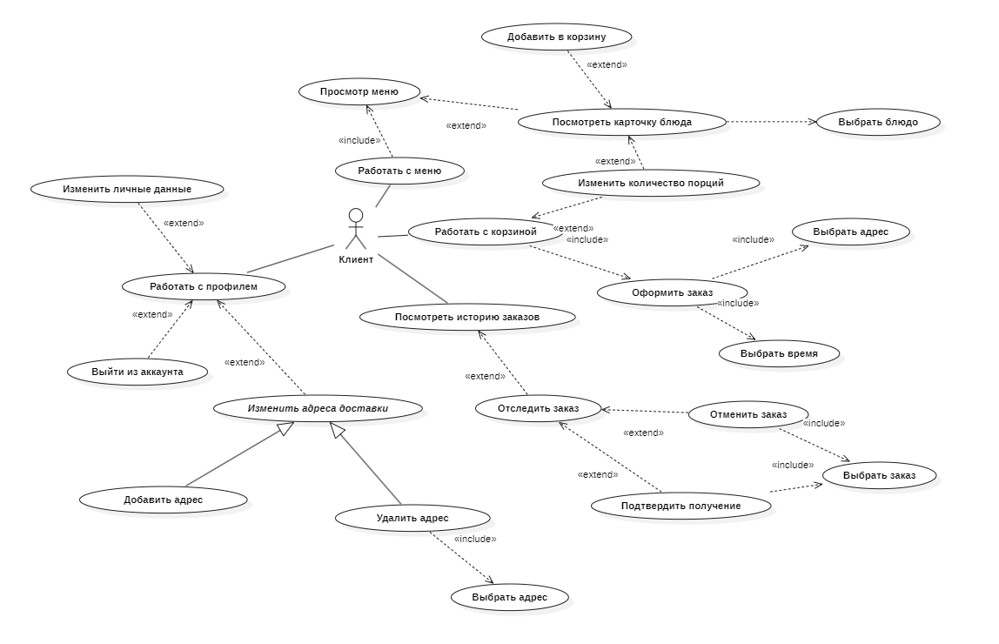

*Рисунок 36 – Диаграмма вариантов использования клиента*

Актер Администратор управляет основными сущностями системы и может: работать с меню, создавая новые, удаляя или редактируя существующие, а также добавлять и удалять блюда; управлять характеристиками блюд, добавляя название, фото, стоимость, описание, калорийность и ингредиенты; работать со списком ингредиентов, добавляя новые позиции или удаляя старые; управлять персоналом – создавать, удалять и редактировать профили менеджеров и курьеров, заполняя их личные данные, контакты и пароли.

<!-- fig-id: fig-37 -->
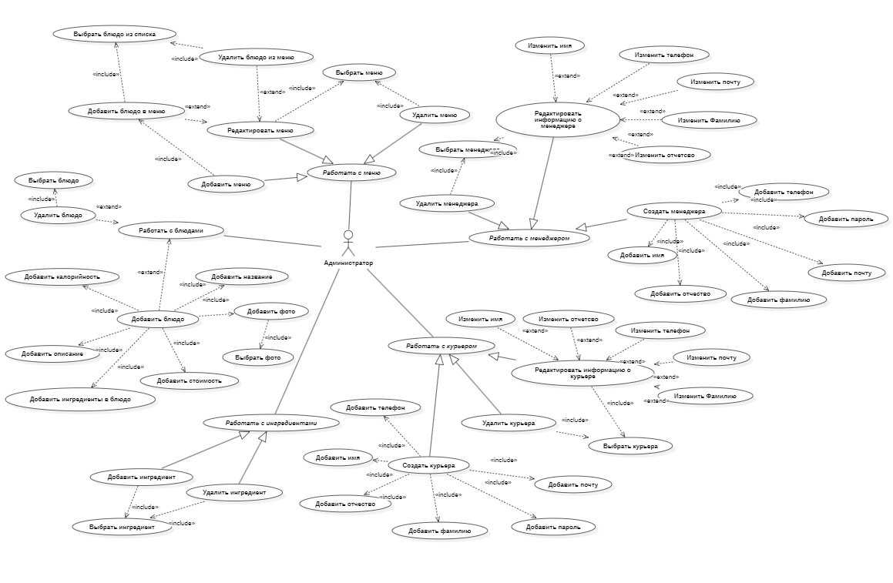

*Рисунок 37 – Диаграмма вариантов использования администратора*

У Курьера есть возможность выполнять следующие действия: выйти из профиля, изменить свой статус работы, просматривать список своих заказов и изменять их статус (предварительно выбрав заказ и подтвердив доставку).

<!-- fig-id: fig-38 -->
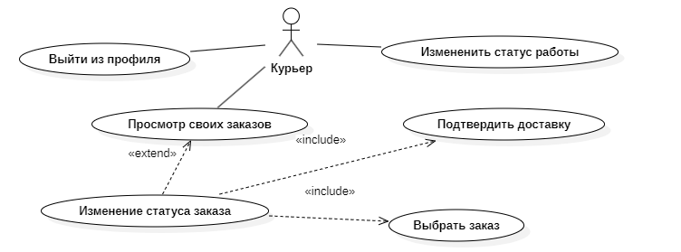

*Рисунок 38 – Диаграмма вариантов использования курьера*

Актер Менеджер отвечает за обработку заказов и может: назначать заказы курьерам (предварительно выбрав нужный заказ) или редактировать их. При редактировании заказа менеджер может добавить новое блюдо, выбрав его из списка, либо удалить уже добавленную позицию. Также менеджер имеет возможность отменить заказ.

<!-- fig-id: fig-39 -->
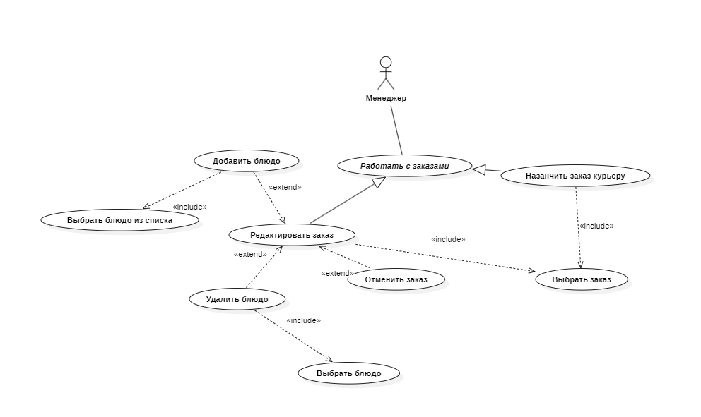

*Рисунок 39 – Диаграмма вариантов использования менеджера*

##### Сценарии

Сценарий (scenario) – определенная последовательность действий, которая описывает действия актеров и поведение моделируемой системы в форме обычного текста [27].

В контексте языка UML сценарий используется для дополнительной иллюстрации взаимодействия актеров и вариантов использования.

Рассмотрим несколько сценариев.

Вариант использования «Установить статус работы»

Краткое описание. Позволяет курьеру изменить свой рабочий статус («Работает» / «Не работает») на текущий день через мобильное веб-приложение. Система обновляет доступность курьера для назначения новых заказов и уведомляет менеджера об изменении статуса.

Актант. Курьер.

Предусловия. Смартфон курьера включён, соединение с интернетом установлено. Курьер успешно авторизован в системе. Открыта страница «Мои заказы» или «Профиль» мобильного приложения. В интерфейсе отображается переключатель рабочего статуса (см. рисунок 33).

Основной поток событий.

### Курьер нажимает на переключатель статуса работы («Статус: работаю» / «Статус: выходной») на странице «Мои заказы» или в разделе «Профиль».

### Система отображает модальное окно подтверждения с текущим статусом и кнопками «Подтвердить», «Отмена».

Курьер нажимает на кнопку «Подтвердить».

А1: Курьер нажимает на кнопку «Отмена» или закрывает модальное окно.

Система проверяет наличие активных заказов, назначенных данному курьеру.

А2: У курьера есть активные заказы при попытке установить статус «Не работает».

Система закрывает модальное окно.

Система обновляет статус курьера в базе данных. 
Система отправляет уведомление менеджеру об изменении статуса курьера.

Система обновляет визуальный индикатор статуса в интерфейсе:

зелёный маркер «Работает», если статус изменён на активный;

серый маркер «Выходной», если статус изменён на неактивный.

А3: Ошибка сетевого соединения при обновлении статуса.

Система отображает всплывающее сообщение: «Статус успешно обновлён».

Система сохраняет изменения в сессии. Вариант использования завершается успешно.

Альтернативы.

А1: Курьер нажимает на кнопку «Отмена» или закрывает модальное окно.

А1.1 Система закрывает модальное окно подтверждения без сохранения изменений.

А1.2 Вариант использования завершается.

А2: У курьера есть активные заказы при попытке установить статус «Не работает».

А2.1 Система отображает модальное окно с предупреждением: «У вас есть активные заказы. Завершите доставку или передайте заказы менеджеру перед сменой статуса». На форме располагаются кнопки «ОК» и «Отмена».

А2.А1: Курьер щёлкает кнопку «ОК».

А2.А1.1 Модальное окно с предупреждением закрывается.

А2.А1.2 Осуществляется переход к п.1 основного потока событий.

А2.А2: Курьер щёлкает кнопку «Отмена».

А2.А2.1 Система отменяет изменение статуса.

А2.А2.2 Вариант использования завершается.

А3: Ошибка сетевого соединения при обновлении статуса.

А3.1 Система отображает модальное окно с сообщением об ошибке: «Не удалось обновить статус. Проверьте подключение к интернету и повторите попытку». На форме располагаются кнопки «Повторить» и «Отмена».

А3.А1: Курьер щёлкает кнопку «Повторить».

А3.А1.1 Система повторно отправляет запрос на обновление статуса.

А3.А1.А1: Переход к п.5 основного потока. При неудаче – возврат к п.А3.1.

А3.А2: Курьер щёлкает кнопку «Отмена».

А3.А2.1 Система отменяет изменение статуса.

А3.А2.2 Вариант использования завершается.

Постусловия. При успешном завершении статус курьера обновлён в базе данных и отображается в интерфейсе. Менеджер получил уведомление об изменении доступности курьера. Система учитывает новый статус при назначении новых заказов. Визуальный индикатор статуса соответствует выбранному значению.

Вариант использования «Изменить количество порций»

Краткое описание. Позволяет клиенту изменить количество порций выбранного блюда в заказе в диапазоне от 1 до 16 штук. Система автоматически пересчитывает итоговую стоимость заказа с учётом изменённого количества. Расширяет вариант использования «Работать с корзиной».

Актант. Клиент.

Предусловия. Смартфон клиента включён, соединение с интернетом установлено. Клиент успешно авторизован в системе и находится на странице меню и открыл карточку блюда. Блюдо добавлено в корзину или просматривается для добавления. В корзине менее 8 различных блюд (см. рисунок 34).

Основной поток событий.

Система отображает текущее количество порций (по 
умолчанию 1).

Клиент нажимает на кнопку «+» в карточке блюда.

А1: Клиент нажимает на кнопку «–» в карточке блюда.

А2: Клиент нажимает на поле ввода в карточке блюда.

Система увеличивает количество порций на 1.

А3: Достигнуто максимальное количество порций (16).

Система обновляет отображение количества порций в интерфейсе.

Система автоматически пересчитывает стоимость позиции (Стоимость = Цена блюда × Количество порций).

Система обновляет итоговую сумму заказа в корзине.

Вариант использования завершается успешно.

Альтернативы.

А1: Клиент нажимает на кнопку «–» в карточке блюда или корзине.

А1.1 Система проверяет текущее количество порций для данного блюда.

А1.2 Если текущее количество порций больше 1, система уменьшает количество на 1.

А1.2.1 Выполняются шаги 4-6 основного потока.

А1.3 Если текущее количество порций равно 1, система не выполняет уменьшение.

А1.3.1 Кнопка неактивна.

А1.3.2 Вариант использования завершается без изменений корзины.

А2: Клиент нажимает на поле ввода количества порций в карточке блюда или в корзине.

А2.1 Система делает поле ввода активным и выделяет его.

А2.2 Система отображает виртуальную цифровую клавиатуру.

А2.3 Клиент вводит новое значение с клавиатуры и нажимает клавишу «Готово» или «Enter».

А2.4 Система проверяет введённое значение.

А2.4.1 Если введённое значение является целым числом в диапазоне от 1 до 16, система устанавливает количество порций равным введённому значению. Выполняются шаги 4-6 основного потока.

А2.4.2 Если введённое значение меньше 1, система устанавливает количество порций равным 1. Система отображает сообщение: «Минимальное количество порций для одного блюда - 1». Выполняются шаги 4-6 основного потока.

А2.4.3 Если введённое значение больше 16, система устанавливает количество порций равным 16. Система отображает сообщение: «Максимальное количество порций для одного блюда - 16». Выполняются шаги 4-6 основного потока.

А2.4.4 Если введённое значение не является целым числом (например, буквы, символы, дробное число), система игнорирует ввод и восстанавливает предыдущее корректное значение. Система отображает сообщение об ошибке: «Введите целое число от 1 до 16». Сообщение автоматически закрывается через несколько секунд. Вариант использования завершается без изменений.

А3: Достигнуто максимальное количество порций (16).

А3.1 При попытке увеличения количества порций сверх 16 система не выполняет увеличение.

А3.2 Система отображает сообщение: «Максимальное количество порций для одного блюда - 16».

А3.3 Сообщение автоматически закрывается через несколько секунд.

А3.4 Вариант использования завершается без изменений корзины.

Постусловия. При успешном завершении в корзине отображается обновлённое количество порций выбранного блюда. Стоимость данного блюда пересчитана в соответствии с новым количеством порций. Итоговая стоимость заказа пересчитана и отображена корректно. Все ограничения соблюдены (количество порций от 1 до 16). Изменения сохранены в сессии заказа до момента подтверждения оформления.

Вариант использования «Назначить заказ курьеру»

Краткое описание. Позволяет менеджеру назначить поступивший заказ свободному курьеру. Является частью варианта использования «Работать с заказами» (см. рисунок 22).

Актант. Менеджер.

Предусловия. Компьютер включён, вход в систему в режиме менеджера выполнен успешно. Менеджер выбирает раздел «Заказы» в боковом навигационном меню. На экране отображена страница «Заказы». В системе имеется хотя бы один заказ со статусом «Новый» и хотя бы один курьер со статусом «Свободен».

Основной поток событий.

Система выводит на экран таблицу заказов с колонками «Номер заказа», «Статус», «Имя клиента», «Адрес доставки», «Время заказа». По умолчанию отображаются заказы со статусом «Новый». В правой части каждой строки располагается кнопка «…» (три точки).

Менеджер щёлкает ЛКМ по кнопке «…» в строке нужного заказа.

А1: Менеджер щёлкает ЛКМ по кнопке «Обновить» на странице заказов.

Система разворачивает контекстное меню с пунктами: «Назначить курьера» и «Отменить заказ».

Менеджер щёлкает ЛКМ по пункту «Назначить курьера».

А2: Менеджер щёлкает ЛКМ по пункту «Отменить заказ».

Система открывает модальное окно со списком свободных курьеров. В окне отображается список курьеров со статусом «Свободен» с полями «ФИО курьера» и «Телефон». Также имеются кнопки «Подтвердить» и «Отмена».

А3: Список свободных курьеров пуст.

Менеджер щёлкает ЛКМ по строке нужного курьера в списке.

А4: Менеджер щёлкает ЛКМ по кнопке «Отмена» в модальном окне.

Система фиксирует выбранного курьера и делает активной кнопку «Подтвердить».

Менеджер щёлкает ЛКМ по кнопке «Подтвердить».

Система закрывает модальное окно, присваивает заказу статус «В доставке» и фиксирует назначенного курьера. В таблице заказов строка обновляется: в поле «Статус» отображается «В доставке». Вариант использования завершается успешно.

Альтернативы.

А1: Менеджер щёлкает ЛКМ по кнопке «Обновить» на странице заказов.

А1.1 Система обновляет таблицу заказов, загружая актуальные данные из базы данных.

А1.2 Осуществляется переход к п. 3 основного потока событий.

А2: Менеджер щёлкает ЛКМ по пункту «Отменить заказ».

А2.1 Выполняется вариант использования «Отменить заказ».

А3: Список свободных курьеров пуст.

А3.1 Система выводит в модальном окне сообщение «Нет доступных курьеров». Назначение невозможно. Кнопка «Подтвердить» недоступна.

А3.2 Менеджер щёлкает ЛКМ по кнопке «🅇». Модальное окно закрывается. Вариант использования завершается.

А4: Менеджер щёлкает ЛКМ по кнопке «Отмена» в модальном окне.

А4.1 Система закрывает модальное окно без сохранения изменений. Вариант использования завершается.

Постусловия. При успешном завершении заказу присвоен статус «В доставке», курьеру назначен данный заказ. На экране отображена актуальная таблица заказов.

Неясные вопросы. Уточнить, обновляется ли статус курьера на «Занят» автоматически при назначении заказа. Уточнить, уведомляется ли курьер о новом заказе через push-уведомление или иным способом.

##### Диаграмма состоний

Текст Текст Текст Текст Текст Текст Текст Текст Текст Текст Текст Текст Текст Текст Текст Текст Текст Текст Текст Текст Текст Текст Текст Текст Текст Текст Текст Текст Текст Текст Текст Текст Текст Текст Текст.

<!-- fig-id: fig-39 -->

*Рисунок 33 – Диаграмма состояний менеджера*

<!-- fig-id: fig-39 -->

*Рисунок 33 – Диаграмма состояний менеджера*

<!-- fig-id: fig-39 -->

*Рисунок 33 – Диаграмма состояний менеджера*

<!-- fig-id: fig-39 -->

*Рисунок 33 – Диаграмма состояний менеджера*

На рисунке ХХХ приведена диаграмма состояний системы. Здесь должно быть описание диаграммы (диаграмм).

##### Диаграмма последовательности

Текст Текст Текст Текст Текст Текст Текст Текст Текст Текст Текст Текст Текст Текст Текст Текст Текст Текст Текст Текст Текст Текст Текст Текст Текст Текст Текст Текст Текст Текст Текст Текст Текст Текст Текст.

На рисунке ХХХ приведена диаграммы последовательности системы для варианта использования «???». Диаграммы построены на основании сценариев, приведенных в п.2.4.3.

#### Логическая модель данных (при необходимости)

Логическая информационная модель – модель данных, в которой учитывается способ логического хранения данных в памяти ЭВМ. При построении модели базы данных (БД) используются следующие понятия.

Сущность – объект предметной области, который можно отличить от других понятий по некоторым признакам. Сущность состоит из множества своих экземпляров. Каждая сущность обладает свойствами – атрибутами [Ошибка: источник перекрёстной ссылки не найден].

Атрибут – определенное свойство сущности. Именно набор атрибутов, в общем случае уникальный для каждой сущности, позволяет выделить ее среди других объектов и назвать уникальным именем.

Атрибут или набор атрибутов, используемый для идентификации экземпляра сущности, называется ключом сущности. В случае если для идентификации экземпляра используется один атрибут, ключ называется простым; в противном случае ключ составной. Каждый экземпляр сущности однозначно определяется ключом [Ошибка: источник перекрёстной ссылки не найденОшибка: источник перекрёстной ссылки не найден].

Логическая модель БД разрабатываемой системы приведена на рисунке ХХХ.

<!-- fig-id: fig-40 -->
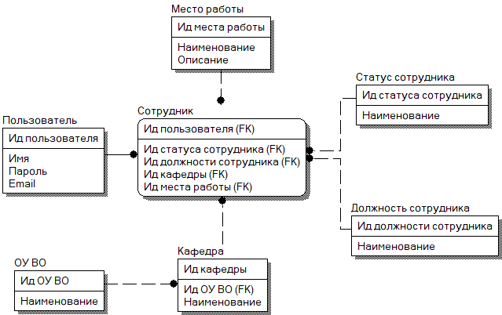

*Рисунок 1 – Логическая модель данных*

Описание объектов рассматриваемой предметной области, которые хранятся в базе данных, приведено в таблицах 2-???.

Таблица 2 – Сущность «Пользователь»

| Идентификатор | Тип данных | Описание |
| --- | --- | --- |
| Ид пользователя | Целый | Уникальный идентификатор пользователя |
| Имя | Символьный[30] | Имя, используемое при идентификации пользователя и его взаимодействии с системой |
| Пароль | Символьный[10] | Пароль пользователя, преобразованный в закодированную строку |
| Email | Символьный[50] | Электронная почта, указанная пользователем при регистрации |

#### Выбор и обоснование алгоритмов обработки данных /Разработка и описание алгоритмов обработки данных

Вводные слова про необходимость разработки алгоритмов.

На рисунке ХХХ приведена схема алгоритма обработки элементов массива. Здесь должно быть краткое описание алгоритма.

<!-- fig-id: fig-41 -->
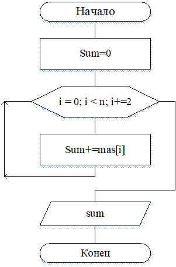

*Рисунок ХХХ – Схема алгоритма обработки элементов массива*

На рисунке ХХХХ приведена схема алгоритма вычисления исходного выражения.

#### Выбор и обоснование комплекса программных средств

Текст Текст Текст Текст Текст Текст Текст Текст Текст Текст Текст Текст Текст Текст Текст Текст Текст Текст Текст Текст Текст Текст Текст Текст Текст Текст Текст Текст Текст Текст Текст Текст Текст Текст Текст.

Текст Текст Текст Текст Текст Текст Текст Текст Текст Текст Текст Текст Текст Текст Текст Текст Текст Текст Текст Текст Текст Текст Текст Текст Текст Текст Текст Текст Текст Текст Текст Текст Текст Текст Текст.

##### Выбор языка программирования

Текст Текст Текст Текст Текст Текст Текст Текст Текст Текст Текст Текст Текст Текст Текст Текст Текст Текст Текст Текст Текст Текст Текст Текст Текст Текст Текст Текст Текст Текст Текст Текст Текст Текст Текст.

Текст Текст Текст Текст Текст Текст Текст Текст Текст Текст Текст Текст Текст Текст Текст Текст Текст Текст Текст Текст Текст Текст Текст Текст Текст Текст Текст Текст Текст Текст Текст Текст Текст Текст Текст. Текст Текст Текст Текст Текст Текст Текст Текст Текст Текст Текст Текст Текст Текст Текст Текст Текст Текст Текст Текст Текст Текст Текст Текст Текст Текст Текст Текст Текст Текст Текст Текст Текст Текст Текст.

##### Выбор среды программирования

Текст Текст Текст Текст Текст Текст Текст Текст Текст Текст Текст Текст Текст Текст Текст Текст Текст Текст Текст Текст Текст Текст Текст Текст Текст Текст Текст Текст Текст Текст Текст Текст Текст Текст Текст.

##### Выбор операционной системы

Текст Текст Текст Текст Текст Текст Текст Текст Текст Текст Текст Текст Текст Текст Текст Текст Текст Текст Текст Текст Текст Текст Текст Текст Текст Текст Текст Текст Текст Текст Текст Текст Текст Текст Текст.

##### Выбор системы управления базами данных (при необходимости)

Текст Текст Текст Текст Текст Текст Текст Текст Текст Текст Текст Текст Текст Текст Текст Текст Текст Текст Текст Текст Текст Текст Текст Текст Текст Текст Текст Текст Текст Текст Текст Текст Текст Текст Текст.
