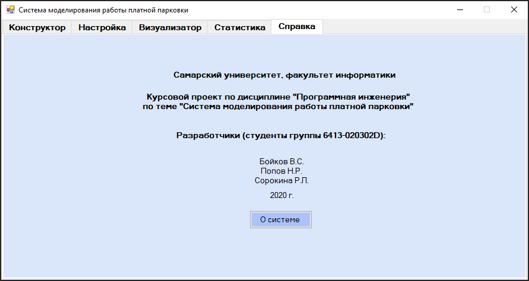
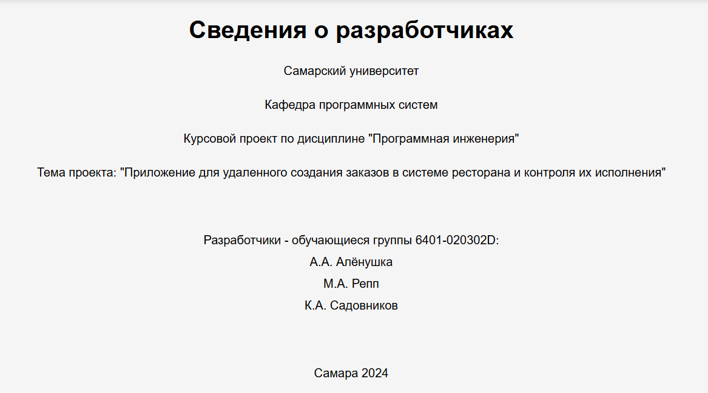

# Реализация системы

#### Разработка и описание интерфейса пользователя

Текст Текст Текст Текст Текст Текст Текст Текст Текст Текст Текст Текст Текст Текст Текст Текст Текст Текст Текст Текст Текст Текст Текст Текст Текст Текст Текст Текст Текст Текст Текст Текст Текст Текст Текст.

Текст Текст Текст Текст Текст Текст Текст Текст Текст Текст Текст Текст Текст Текст Текст Текст Текст Текст Текст Текст Текст Текст Текст Текст Текст Текст Текст Текст Текст Текст Текст Текст Текст Текст Текст.

На рисунках приведены примеры того, как нужно оформить сведения о разработчиках.

<!-- fig-id: fig-42 -->

*Рисунок ХХХ – Сведения о разработчиках*

<!-- fig-id: fig-43 -->

*Рисунок ХХХ – Сведения о разработчиках*

#### Диаграммы реализации

Диаграммы реализации предназначены для отображения состава компилируемых и выполняемых модулей системы, а также связей между ними. Диаграммы реализации разделяются на два конкретных вида: диаграммы компонентов (component diagrams) и диаграммы развертывания (deployment diagrams) [ХХХ].

##### Диаграмма компонентов

Текст Текст Текст Текст Текст Текст Текст Текст Текст Текст Текст Текст Текст Текст Текст Текст Текст Текст Текст Текст Текст Текст Текст Текст Текст Текст Текст Текст Текст Текст Текст Текст Текст Текст Текст.

На рисунке ХХХ приведена диаграмма компонентов, их описание приведено в таблице ХХХ.

Таблица ХХХ – Описание компонентов системы

| Название компонента | Назначение компонента | Подсистема |
| --- | --- | --- |
|  |  |  |
|  |  |  |
|  |  |  |
|  |  |  |

##### Диаграмма развертывания

Текст Текст Текст Текст Текст Текст Текст Текст Текст Текст Текст Текст Текст Текст Текст Текст Текст Текст Текст Текст Текст Текст Текст Текст Текст Текст Текст Текст Текст Текст Текст Текст Текст Текст Текст.

На рисунке ХХХ приведена диаграмма развертывания системы. Здесь должно быть описание тех компонентов, которые развернуты на узлах ЭВМ.

##### Диаграмма классов

Диаграммы классов – это наиболее часто используемый тип диаграмм, которые создаются при моделировании объектно-ориентированных систем, они показывают набор классов, интерфейсов и коопераций, а также их связи. На практике диаграммы классов применяют для моделирования статического представления системы, они служат основой для целой группы взаимосвязанных диаграмм – диаграмм компонентов и диаграмм размещения [ХХХ].

На рисунке ХХ приведена диаграмма классов системы (этап реализации). В таблице ХХ приведено описание классов.

Таблица ХХ – Описание классов системы

| Название класса | Назначение |
| --- | --- |
|  |  |
|  |  |
|  |  |
|  |  |

#### Физическая модель данных (при необходимости)

Физическое проектирование является последним этапом проектирования базы данных, при выполнении которого принимается решение о способах реализации разрабатываемой базы данных. Во время логического проектирования была определена логическая структура базы данных (которая описывает отношения и ограничения в рассматриваемой прикладной области).

Физическая модель базы данных содержит все детали, необходимые конкретной СУБД для создания базы: наименования таблиц и столбцов, типы данных, определения первичных и внешних ключей [??].

На рисунке Ошибка: источник перекрёстной ссылки не найден представлена физическая модель данных системы.

В таблицах ??-?? приведено описание сущностей БД. Первичные ключи выделены жирным шрифтом, а внешние – курсивом.

Таблица ХХХ – Сущность «User»

| Имя поля | Имя атрибута | Тип | Размер (байт) |
| --- | --- | --- | --- |
| user Id | uniqueidentifier | int | 4 |
| Name | Имя пользователя | varchar(30) | 30 |
| Password | Пароль | varchar(10) | 10 |
| e-mail | Адрес электронной почты | varchar(50) | 50 |
| Размер записи | Размер записи | Размер записи | 94 |

#### Выбор и обоснование комплекса технических средств

##### Расчет объема занимаемой памяти

Расчет объема внешней памяти

Для расчета необходимого объема свободной внешней памяти, необходимой для функционирования системы, воспользуемся следующей формулой:

VЖД = VОС + VПР + VСПО + VБД + Vсправки,

где VОС – объем памяти, занимаемый операционной системой (операционная система Windows 7 Professional 64 бит с пакетом обновлений SP1, 
VОС = 20 Гб);

VПР – объем памяти, занимаемый непосредственно файлами приложения (VПР = 2 Мб);

VСПО – объем памяти, занимаемый сопутствующим программным обеспечением (библиотеки cryptopp.dll, simplexlsx.dll, sqlite3.dll, sqlitecpp.dll, Qt Framework 5.11.1, Internet Explorer 9; дадим оценку сверху VСПО в 3 Гб);

VБД – объем памяти, занимаемый базой данных (всеми таблицами) при ее максимальном заполнении. Расчет этой составляющей приведен в таблице ХХХ (VБД = ???? байт = ??? Кб = ??? Мб = ??? Гб).

Таблица 1 – Расчет объема внешней памяти, необходимой для хранения БД

| Таблица | Размер записи (байт) | Максимум записей | Всего (байт) |
| --- | --- | --- | --- |
| Пользователь | 94 | 10 | 940 |
| Сотрудник |  | 30 |  |
| Статус сотрудника |  | 10 |  |
| Должность сотрудника |  | 10 |  |
| Место работы |  | 10 |  |
| Кафедра |  | 10 |  |
| ОУ ВО |  | 10 |  |
| Итого | Итого | Итого |  |

Vсправки – объем памяти, необходимый для хранения файла справки (Vсправки =0,8 Мб).

Таким образом, суммарный объем внешней памяти составит:

VЖД = 20 Гб + 2 Мб + 3 Гб + ??? Мб + 1 Мб ~ ??? Гб.

Расчет объема ОЗУ

Для расчета необходимого объема ОЗУ воспользуемся следующей формулой:

VОЗУ = VОС + VПР + VБД + Vбраузера,

где VОС – ОЗУ, занимаемое операционной системой (2 Гб);

VПР – ОЗУ, которое займет само приложение (не превысит 80 Мб);

VБД – объем данных из базы, который может быть одновременно загружен в оперативную память (дадим ему оценку сверху в 10 Мб).

Vбраузера – ОЗУ, занимаемое браузером (оценим его сверху значением в 100 Мб).

Суммарные объемы ОЗУ составит:

VОЗУ = 2 Гб + 80 Мб + 10 МБ + 100 Мб ~ 2.2 Гб.

Таким образом, 3 Гб оперативной памяти можно счесть минимально необходимым для функционирования системы.

##### Минимальные требования, предъявляемые к системе

Для корректного функционирования системы необходимо:

тип ЭВМ: x86-64 совместимый;

объем ОЗУ – не менее 3 Гб;

объем свободного дискового пространства – не менее ??? Гб;

клавиатура или иное устройство ввода;

мышь или иное манипулирующее устройство;

процессор – Intel Pentium не менее 1,5 ГГц;

дисплей с разрешением не менее 1024 × 768 пикселей;

операционная система Windows 7 и выше;

браузер Internet Explorer 9 и выше;

Qt framework 5.11 и выше.
